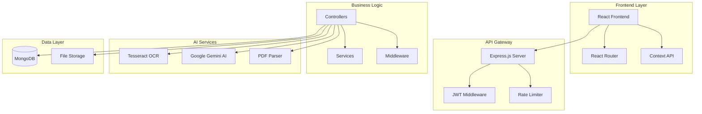
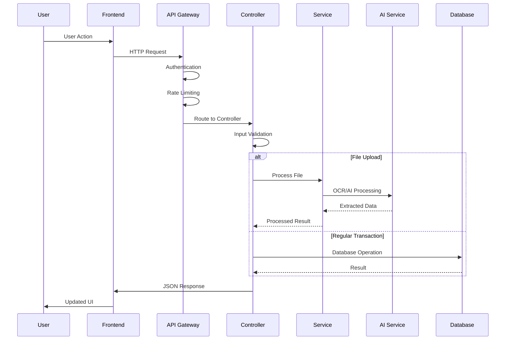
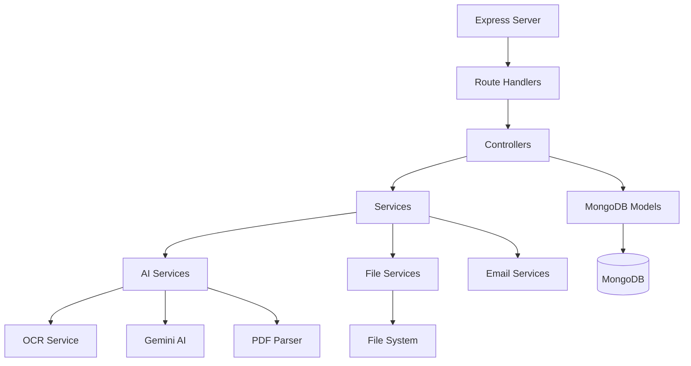
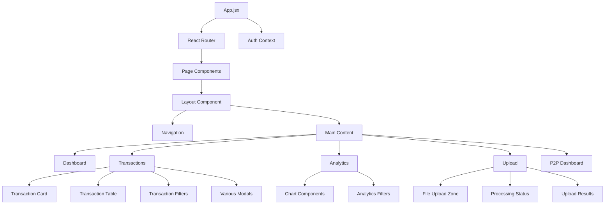
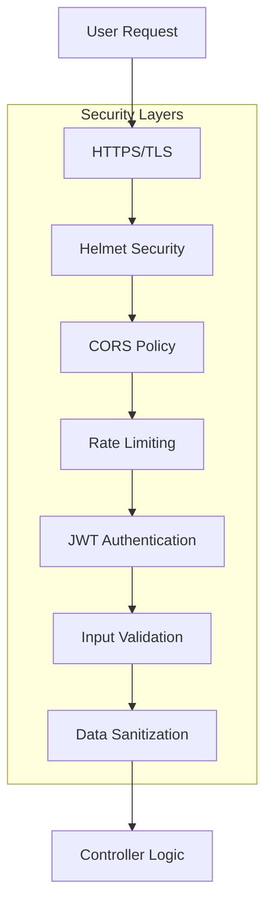
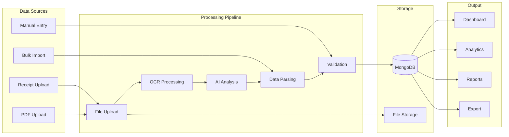
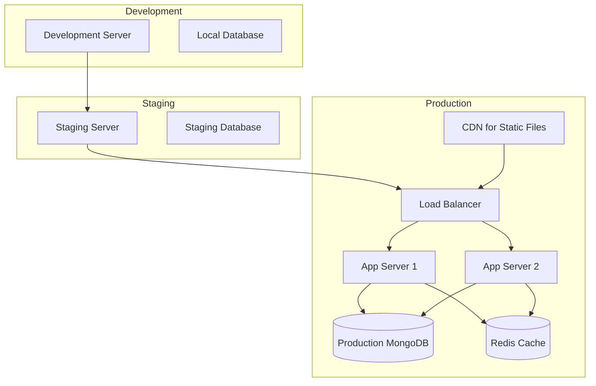
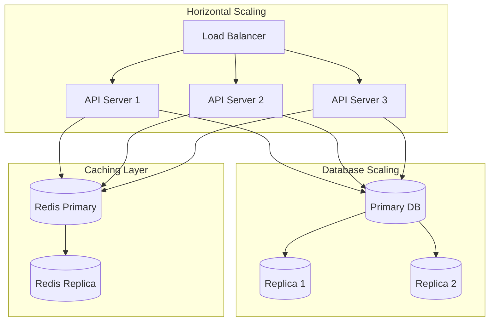

# 🏗️ System Architecture Overview

## 🎯 High-Level Architecture



## 🔄 Request Flow Architecture



## 📁 Project Structure

```
personal-finance-assistant/
├── backend/                    # Node.js Backend
│   ├── src/
│   │   ├── config/            # Database configuration
│   │   ├── controllers/       # Request handlers
│   │   ├── middleware/        # Custom middleware
│   │   ├── models/           # MongoDB schemas
│   │   ├── routes/           # API route definitions
│   │   ├── services/         # Business logic & AI services
│   │   ├── utils/            # Helper utilities
│   │   └── server.js         # Application entry point
│   ├── uploads/              # File storage
│   └── package.json
│
├── frontend/                  # React Frontend
│   ├── src/
│   │   ├── components/       # Reusable UI components
│   │   ├── pages/           # Page components
│   │   ├── context/         # React Context providers
│   │   ├── utils/           # Frontend utilities
│   │   └── App.jsx          # Main application component
│   ├── public/              # Static assets
│   └── package.json
│
└── projdoc/                  # Project documentation
```

## 🔧 Component Architecture

### Backend Components



### Frontend Components



## 🔒 Security Architecture



## 🗃️ Data Flow Architecture



## 🚀 Deployment Architecture



## 📊 Performance Considerations

### Database Optimization
- **Indexing Strategy**: Compound indexes on userId + date + type
- **Query Optimization**: Pagination and filtering at database level
- **Connection Pooling**: MongoDB connection pooling for scalability

### API Performance
- **Rate Limiting**: 100 requests per 15 minutes per IP
- **Response Compression**: Gzip compression for API responses
- **Caching Strategy**: Redis for frequent queries

### Frontend Optimization
- **Code Splitting**: React lazy loading for pages
- **Bundle Optimization**: Vite for optimized builds
- **Image Optimization**: Sharp for image processing

## 🔄 Scalability Design



---

*This architecture supports the current feature set and is designed for scalability and maintainability.*