# 🚀 Features & Functionality

## 🎯 Core Features Overview

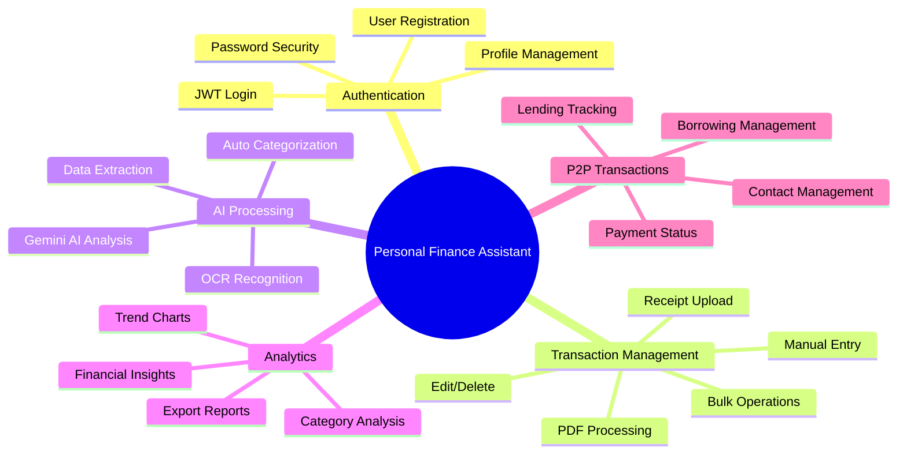

## 🔐 Authentication & User Management

### User Registration & Login
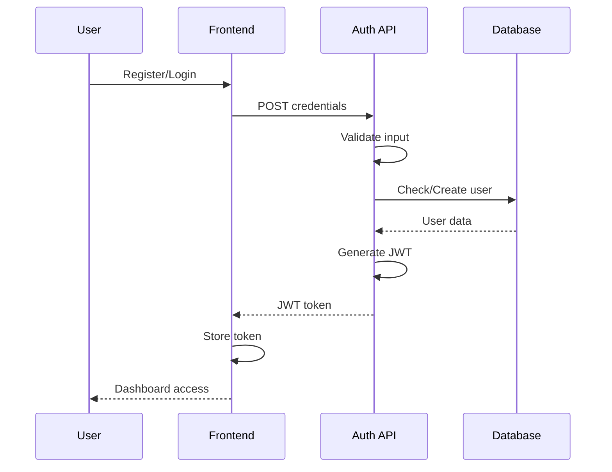

**Features:**
- ✅ Secure user registration with email validation
- ✅ JWT-based authentication with 7-day expiry
- ✅ Password hashing with bcrypt (12 rounds)
- ✅ Protected routes with middleware
- ✅ User profile management
- ✅ Session persistence

## 💰 Transaction Management

### Manual Transaction Entry
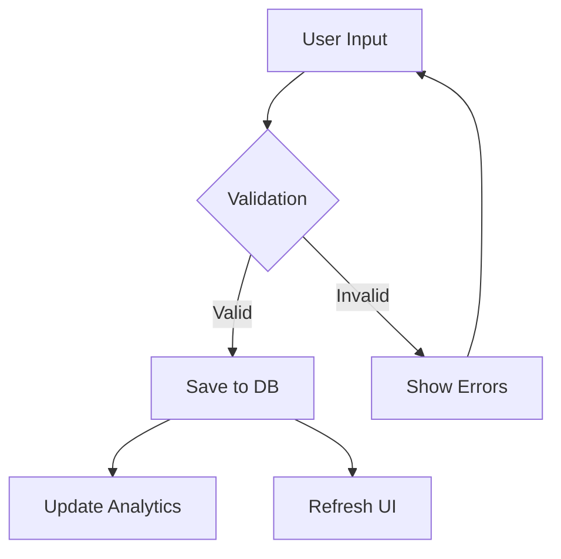

**Features:**
- ✅ Income/Expense/Transfer types
- ✅ Category selection and custom categories
- ✅ Date and amount validation
- ✅ Description and tags support
- ✅ Real-time form validation
- ✅ Currency formatting (INR)

### Receipt Upload & Processing

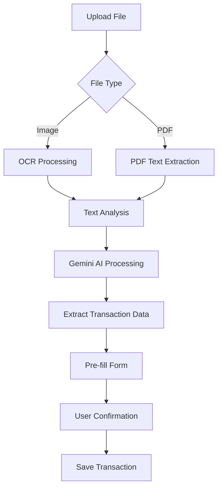

**Supported Formats:**
- 📄 PDF receipts and invoices
- 🖼️ Image formats (JPG, PNG, WEBP)
- 📱 Mobile photos of receipts
- 💾 File size up to 10MB

**AI Processing Features:**
- ✅ OCR text extraction with Tesseract.js
- ✅ Google Gemini AI for intelligent parsing
- ✅ Automatic amount detection
- ✅ Merchant name extraction
- ✅ Date recognition
- ✅ Category suggestion
- ✅ Confidence scoring

### Bulk Operations

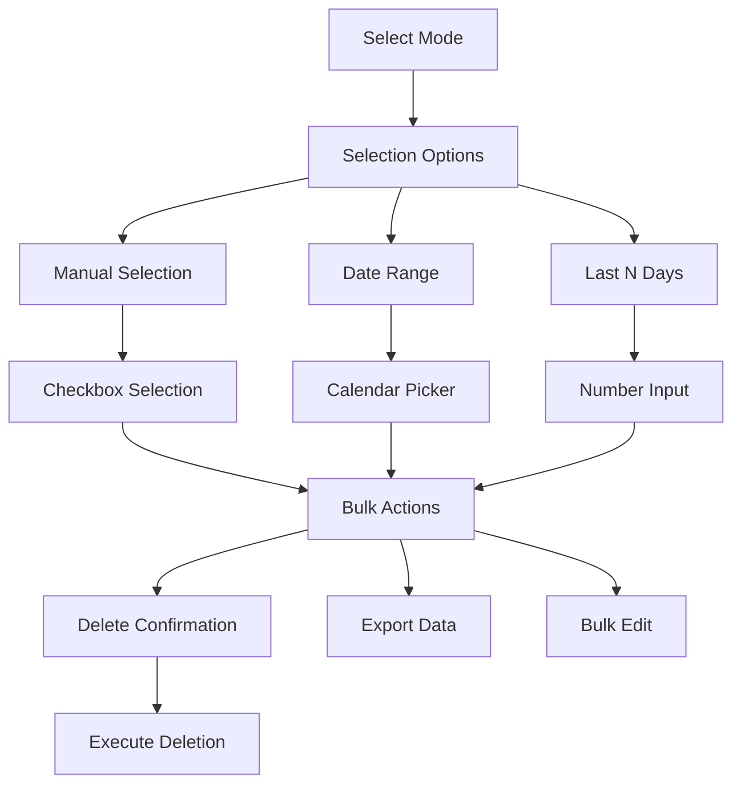

**Bulk Features:**
- ✅ Multi-select transactions with checkboxes
- ✅ Select all/deselect all functionality
- ✅ Date range selection (from/to dates)
- ✅ Last N days selection (1-365 days)
- ✅ Visual selection feedback
- ✅ Bulk delete with confirmation
- ✅ Selection summary with total amounts
- ✅ Undo functionality consideration

## 📊 Analytics & Reporting

### Dashboard Overview
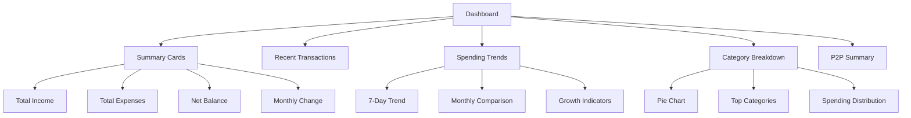

### Advanced Analytics
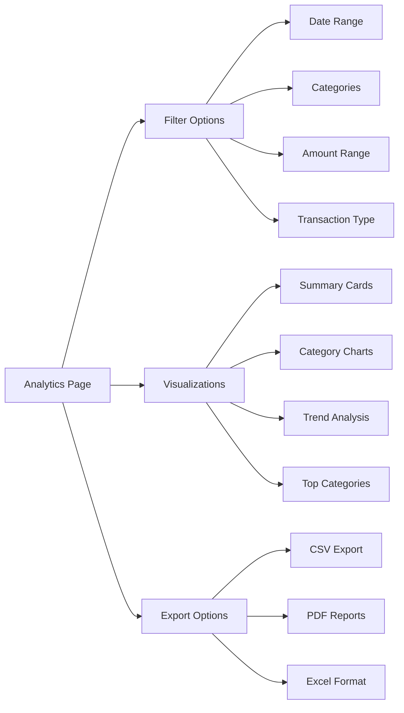

**Analytics Features:**
- ✅ Real-time financial summaries
- ✅ Interactive charts with Recharts
- ✅ Category-wise spending analysis
- ✅ Trend analysis with time series
- ✅ Comparative analysis (month-over-month)
- ✅ Top spending categories
- ✅ Income vs expense visualization
- ✅ Custom date range filtering
- ✅ Export capabilities

## 🤝 P2P Transaction Management

### P2P Transaction Flow
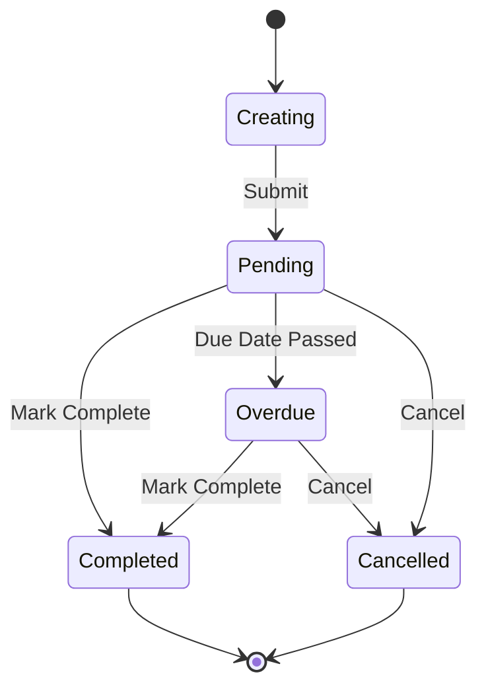

**P2P Features:**
- ✅ Lending (money lent to others)
- ✅ Borrowing (money borrowed from others)
- ✅ Gifts given/received
- ✅ Payments and reimbursements
- ✅ Contact management
- ✅ Due date tracking
- ✅ Status management (pending/completed/overdue)
- ✅ P2P analytics and summaries

### P2P Dashboard
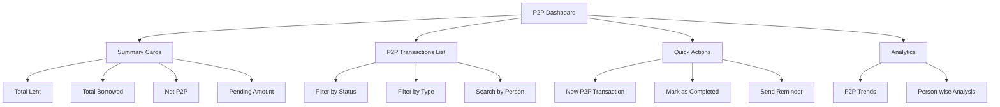

## 📱 User Interface Features

### Responsive Design
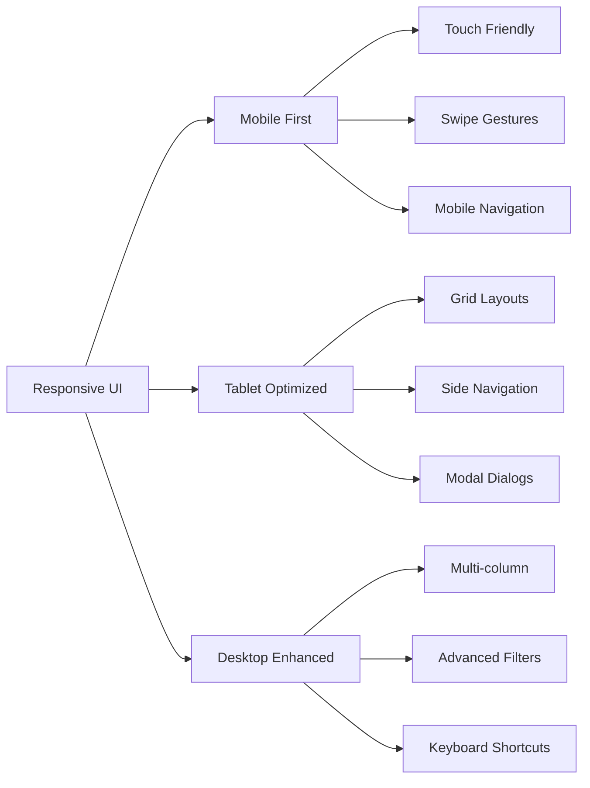

### Interactive Components
- ✅ Dynamic forms with validation
- ✅ Interactive charts and graphs
- ✅ Real-time search and filtering
- ✅ Drag and drop file uploads
- ✅ Modal dialogs for actions
- ✅ Toast notifications
- ✅ Loading states and skeletons
- ✅ Error boundaries

## 🔍 Search & Filtering

### Advanced Filtering System
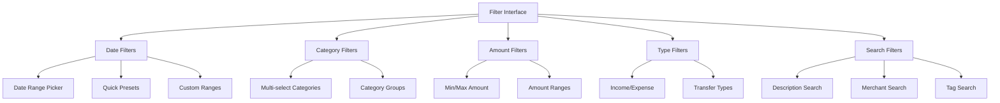

**Search Features:**
- ✅ Real-time search across descriptions
- ✅ Merchant name search
- ✅ Tag-based filtering
- ✅ Category filtering
- ✅ Date range selection
- ✅ Amount range filtering
- ✅ Combined filter conditions
- ✅ Saved filter presets

## 📤 Export & Import Features

### Data Export Options
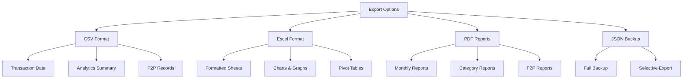

## 🔔 Notification System

### Notification Types
- ✅ Success notifications for completed actions
- ✅ Error notifications for failed operations
- ✅ Warning notifications for validations
- ✅ Info notifications for updates
- ✅ P2P due date reminders
- ✅ Monthly spending summaries

## 🎨 Customization Features

### User Preferences
- ✅ Currency selection (INR default)
- ✅ Date format preferences
- ✅ Theme customization
- ✅ Dashboard layout options
- ✅ Default categories
- ✅ Notification preferences

---

*This comprehensive feature set provides users with a complete personal finance management solution with modern UX and advanced capabilities.*