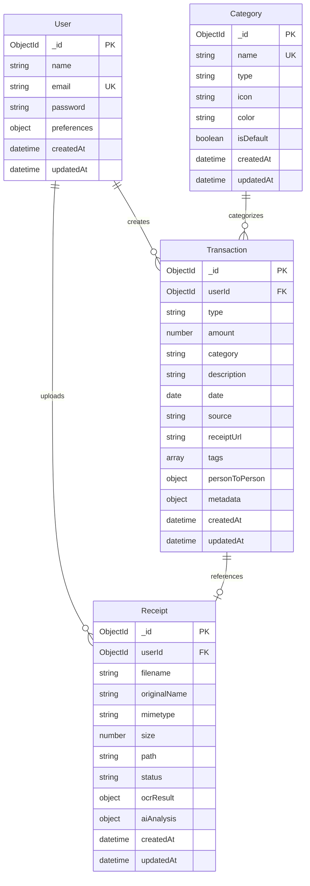
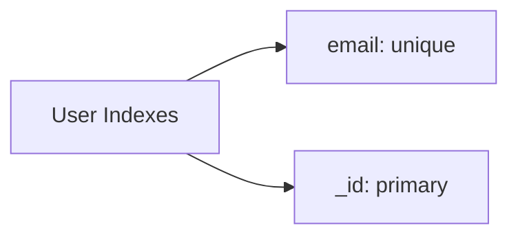
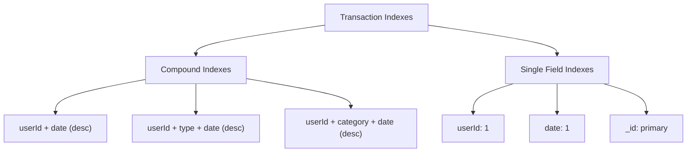
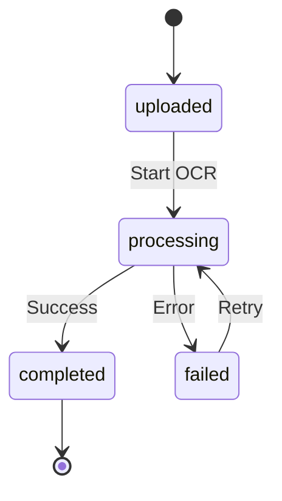
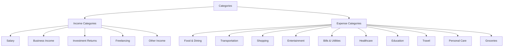
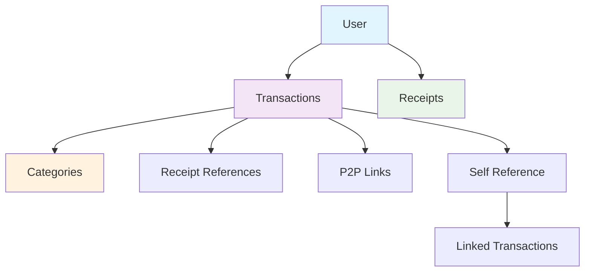
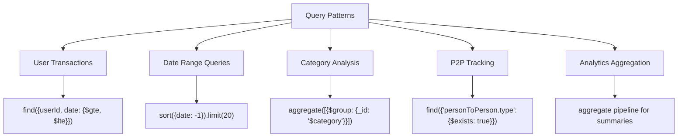
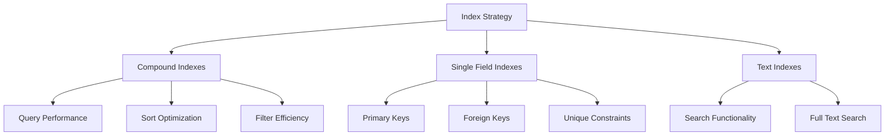
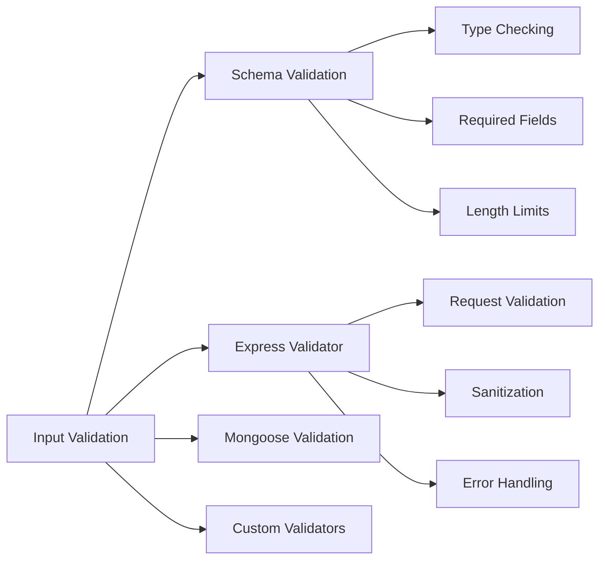

# 🗄️ Database Schema & Data Models

## 📊 Database Overview



## 👤 User Model

### Schema Definition
```javascript
const userSchema = {
    name: {
        type: String,
        required: true,
        trim: true,
        maxlength: 50
    },
    email: {
        type: String,
        required: true,
        unique: true,
        lowercase: true,
        match: /^\w+([.-]?\w+)*@\w+([.-]?\w+)*(\.\w{2,3})+$/
    },
    password: {
        type: String,
        required: true,
        minlength: 6
    },
    preferences: {
        currency: { type: String, default: 'INR' },
        timezone: { type: String, default: 'UTC' }
    }
}
```

### Indexes


### Security Features
- ✅ Password hashing with bcrypt (12 rounds)
- ✅ Email validation with regex
- ✅ Unique email constraint
- ✅ Password exclusion in JSON responses

## 💰 Transaction Model

### Schema Definition
```javascript
const transactionSchema = {
    userId: {
        type: ObjectId,
        ref: 'User',
        required: true,
        index: true
    },
    type: {
        type: String,
        enum: ['income', 'expense', 'transfer'],
        required: true
    },
    amount: {
        type: Number,
        required: true,
        min: 0.01
    },
    category: {
        type: String,
        required: true,
        trim: true
    },
    description: {
        type: String,
        trim: true,
        maxlength: 200
    },
    date: {
        type: Date,
        required: true,
        index: true
    },
    source: {
        type: String,
        enum: ['manual', 'receipt', 'pdf', 'image'],
        default: 'manual'
    },
    receiptUrl: String,
    tags: [String],
    
    // P2P Transaction fields
    personToPerson: {
        type: {
            type: String,
            enum: ['lent', 'borrowed', 'gift_given', 'gift_received', 'payment', 'reimbursement']
        },
        personName: String,
        personContact: String,
        dueDate: Date,
        status: {
            type: String,
            enum: ['pending', 'completed', 'overdue', 'cancelled'],
            default: 'pending'
        },
        linkedTransactionId: { type: ObjectId, ref: 'Transaction' },
        notes: String
    },
    
    // AI and OCR metadata
    metadata: {
        confidence: Number,
        originalText: String,
        merchant: String,
        location: String,
        items: [{
            name: String,
            quantity: Number,
            price: Number
        }],
        receiptId: { type: ObjectId, ref: 'Receipt' }
    }
}
```

### Indexes Strategy


### Virtual Fields
```javascript
// Virtual for formatted amount (positive/negative)
transactionSchema.virtual('formattedAmount').get(function() {
    return this.type === 'expense' ? -this.amount : this.amount;
});
```

### Static Methods
```javascript
// Pagination method
transactionSchema.statics.getPaginated = function(userId, options) {
    // Implements pagination with filters
    // Returns paginated results with proper sorting
};
```

## 📄 Receipt Model

### Schema Definition
```javascript
const receiptSchema = {
    userId: {
        type: ObjectId,
        ref: 'User',
        required: true,
        index: true
    },
    filename: {
        type: String,
        required: true
    },
    originalName: {
        type: String,
        required: true
    },
    mimetype: {
        type: String,
        required: true
    },
    size: {
        type: Number,
        required: true
    },
    path: {
        type: String,
        required: true
    },
    status: {
        type: String,
        enum: ['uploaded', 'processing', 'completed', 'failed'],
        default: 'uploaded'
    },
    ocrResult: {
        text: String,
        confidence: Number,
        blocks: Array,
        processedAt: Date
    },
    aiAnalysis: {
        extractedData: {
            amount: Number,
            merchant: String,
            date: Date,
            category: String,
            items: Array
        },
        confidence: Number,
        processedAt: Date
    },
    error: {
        message: String,
        code: String,
        occurredAt: Date
    }
}
```

### File Processing States


## 🏷️ Category Model

### Schema Definition
```javascript
const categorySchema = {
    name: {
        type: String,
        required: true,
        unique: true,
        trim: true
    },
    type: {
        type: String,
        enum: ['income', 'expense', 'both'],
        default: 'both'
    },
    icon: {
        type: String,
        default: 'folder'
    },
    color: {
        type: String,
        default: '#6B7280'
    },
    isDefault: {
        type: Boolean,
        default: false
    },
    description: String
}
```

### Default Categories


## 🔗 Relationships & References

### Data Relationships


### Foreign Key Constraints
- `Transaction.userId` → `User._id`
- `Transaction.metadata.receiptId` → `Receipt._id`
- `Transaction.personToPerson.linkedTransactionId` → `Transaction._id`
- `Receipt.userId` → `User._id`

## 📈 Data Access Patterns

### Common Query Patterns


### Aggregation Pipelines

#### Monthly Summary
```javascript
[
    { $match: { userId: ObjectId, date: { $gte: startDate, $lte: endDate } } },
    { $group: {
        _id: { $dateToString: { format: "%Y-%m", date: "$date" } },
        totalIncome: { $sum: { $cond: [{ $eq: ["$type", "income"] }, "$amount", 0] } },
        totalExpense: { $sum: { $cond: [{ $eq: ["$type", "expense"] }, "$amount", 0] } },
        transactionCount: { $sum: 1 }
    }},
    { $sort: { _id: 1 } }
]
```

#### Category Breakdown
```javascript
[
    { $match: { userId: ObjectId, type: "expense" } },
    { $group: {
        _id: "$category",
        totalAmount: { $sum: "$amount" },
        transactionCount: { $sum: 1 },
        avgAmount: { $avg: "$amount" }
    }},
    { $sort: { totalAmount: -1 } },
    { $limit: 10 }
]
```

## 🎯 Performance Optimization

### Index Strategy


### Query Optimization
- ✅ Proper index usage for common queries
- ✅ Pagination to limit result sets
- ✅ Aggregation pipelines for complex analytics
- ✅ Field projection to reduce data transfer
- ✅ Connection pooling for database connections

## 🔒 Data Security & Validation

### Input Validation


### Security Measures
- ✅ Input sanitization for all user data
- ✅ Password hashing with bcrypt
- ✅ ObjectId validation for references
- ✅ File type validation for uploads
- ✅ Size limits for file uploads
- ✅ XSS protection through validation

## 📊 Data Migration & Seeding

### Database Seeding
```javascript
// Default categories seeding
const defaultCategories = [
    { name: 'Food & Dining', type: 'expense', icon: 'utensils', color: '#ef4444' },
    { name: 'Transportation', type: 'expense', icon: 'car', color: '#3b82f6' },
    { name: 'Salary', type: 'income', icon: 'briefcase', color: '#10b981' }
    // ... more categories
];
```

### Migration Strategy
- ✅ Version-controlled schema changes
- ✅ Data transformation scripts
- ✅ Rollback procedures
- ✅ Index creation/modification
- ✅ Data integrity checks

---

*This database schema is designed for scalability, performance, and data integrity while supporting all application features.*