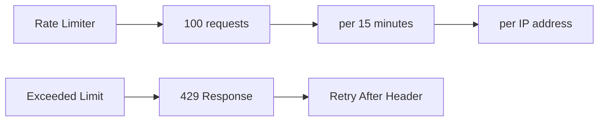

# 🔌 API Documentation & Endpoints

## 🌐 API Overview

```mermaid
graph TD
    A[API Gateway] --> B[Authentication Routes]
    A --> C[Transaction Routes]
    A --> D[Analytics Routes]
    A --> E[File Upload Routes]
    A --> F[Category Routes]
    A --> G[P2P Routes]
    
    B --> B1[/api/auth/*]
    C --> C1[/api/transactions/*]
    D --> D1[/api/analytics/*]
    E --> E1[/api/files/*]
    F --> F1[/api/categories/*]
    G --> G1[/api/transactions/p2p/*]
```

## 🔐 Authentication Endpoints

### Base URL: `/api/auth`

#### POST `/api/auth/register`
**Register a new user**

**Request Body:**
```json
{
    "name": "John Doe",
    "email": "john@example.com",
    "password": "password123"
}
```

**Response (201):**
```json
{
    "message": "User registered successfully",
    "user": {
        "_id": "64f7e8c9d4f123456789abcd",
        "name": "John Doe",
        "email": "john@example.com",
        "preferences": {
            "currency": "INR",
            "timezone": "UTC"
        }
    },
    "token": "eyJhbGciOiJIUzI1NiIsInR5cCI6IkpXVCJ9..."
}
```

#### POST `/api/auth/login`
**Authenticate user login**

**Request Body:**
```json
{
    "email": "john@example.com",
    "password": "password123"
}
```

**Response (200):**
```json
{
    "message": "Login successful",
    "user": {
        "_id": "64f7e8c9d4f123456789abcd",
        "name": "John Doe",
        "email": "john@example.com"
    },
    "token": "eyJhbGciOiJIUzI1NiIsInR5cCI6IkpXVCJ9..."
}
```

#### GET `/api/auth/profile`
**Get current user profile**

**Headers:**
```
Authorization: Bearer <token>
```

**Response (200):**
```json
{
    "user": {
        "_id": "64f7e8c9d4f123456789abcd",
        "name": "John Doe",
        "email": "john@example.com",
        "preferences": {
            "currency": "INR",
            "timezone": "UTC"
        }
    }
}
```

## 💰 Transaction Endpoints

### Base URL: `/api/transactions`

#### GET `/api/transactions`
**List transactions with pagination and filters**

**Query Parameters:**
```
page=1
limit=20
type=expense|income
category=Food
startDate=2024-01-01
endDate=2024-01-31
search=coffee
```

**Response (200):**
```json
{
    "transactions": [
        {
            "_id": "64f7e8c9d4f123456789abce",
            "type": "expense",
            "amount": 250.50,
            "category": "Food & Dining",
            "description": "Coffee at Starbucks",
            "date": "2024-01-15T10:30:00.000Z",
            "source": "manual",
            "tags": ["coffee", "breakfast"],
            "userId": {
                "_id": "64f7e8c9d4f123456789abcd",
                "name": "John Doe"
            }
        }
    ],
    "pagination": {
        "currentPage": 1,
        "totalPages": 5,
        "totalItems": 100,
        "itemsPerPage": 20,
        "hasNextPage": true,
        "hasPrevPage": false
    }
}
```

#### POST `/api/transactions`
**Create a new transaction**

**Request Body:**
```json
{
    "type": "expense",
    "amount": 1200.00,
    "category": "Food & Dining",
    "description": "Dinner at restaurant",
    "date": "2024-01-15T19:30:00.000Z",
    "tags": ["dinner", "restaurant"]
}
```

**Response (201):**
```json
{
    "message": "Transaction created successfully",
    "transaction": {
        "_id": "64f7e8c9d4f123456789abcf",
        "type": "expense",
        "amount": 1200.00,
        "category": "Food & Dining",
        "description": "Dinner at restaurant",
        "date": "2024-01-15T19:30:00.000Z",
        "source": "manual",
        "tags": ["dinner", "restaurant"],
        "userId": "64f7e8c9d4f123456789abcd"
    }
}
```

#### GET `/api/transactions/:id`
**Get single transaction details**

**Response (200):**
```json
{
    "transaction": {
        "_id": "64f7e8c9d4f123456789abcf",
        "type": "expense",
        "amount": 1200.00,
        "category": "Food & Dining",
        "description": "Dinner at restaurant",
        "date": "2024-01-15T19:30:00.000Z",
        "metadata": {
            "merchant": "Restaurant ABC",
            "location": "Mumbai"
        }
    }
}
```

#### PUT `/api/transactions/:id`
**Update transaction**

**Request Body:**
```json
{
    "amount": 1300.00,
    "description": "Updated dinner amount",
    "tags": ["dinner", "restaurant", "anniversary"]
}
```

#### DELETE `/api/transactions/:id`
**Delete single transaction**

**Response (200):**
```json
{
    "message": "Transaction deleted successfully"
}
```

#### DELETE `/api/transactions/bulk`
**Bulk delete transactions**

**Request Body:**
```json
{
    "deleteType": "selected",
    "transactionIds": ["64f7e8c9d4f123456789abcf", "64f7e8c9d4f123456789abd0"]
}
```

**OR Date Range Delete:**
```json
{
    "deleteType": "dateRange",
    "dateRange": {
        "startDate": "2024-01-01",
        "endDate": "2024-01-31"
    }
}
```

**OR Last N Days Delete:**
```json
{
    "deleteType": "lastDays",
    "lastDays": 30
}
```

**Response (200):**
```json
{
    "message": "Successfully deleted 15 transaction(s)",
    "deletedCount": 15,
    "deletedTransactions": [
        {
            "id": "64f7e8c9d4f123456789abcf",
            "amount": 250.50,
            "category": "Food & Dining",
            "date": "2024-01-15T10:30:00.000Z"
        }
    ]
}
```

## 🤝 P2P Transaction Endpoints

### Base URL: `/api/transactions/p2p`

#### POST `/api/transactions/p2p`
**Create P2P transaction**

**Request Body:**
```json
{
    "type": "lent",
    "amount": 5000.00,
    "personName": "Alice Johnson",
    "personContact": "alice@example.com",
    "description": "Loan for emergency",
    "dueDate": "2024-02-15",
    "notes": "To be repaid next month"
}
```

**Response (201):**
```json
{
    "message": "P2P transaction created successfully",
    "transaction": {
        "_id": "64f7e8c9d4f123456789abd1",
        "type": "expense",
        "amount": 5000.00,
        "category": "Personal Transfer",
        "description": "lent - Alice Johnson",
        "personToPerson": {
            "type": "lent",
            "personName": "Alice Johnson",
            "personContact": "alice@example.com",
            "dueDate": "2024-02-15T00:00:00.000Z",
            "status": "pending",
            "notes": "To be repaid next month"
        }
    }
}
```

#### GET `/api/transactions/p2p`
**List P2P transactions**

**Query Parameters:**
```
status=pending|completed|overdue|cancelled
type=lent|borrowed|gift_given|gift_received
page=1
limit=20
```

#### GET `/api/transactions/p2p/summary`
**Get P2P summary**

**Response (200):**
```json
{
    "summary": {
        "totalLent": 15000.00,
        "totalBorrowed": 8000.00,
        "netAmount": 7000.00,
        "pendingLent": 5000.00,
        "pendingBorrowed": 2000.00,
        "breakdown": [
            {
                "_id": "lent",
                "totalAmount": 15000.00,
                "count": 3,
                "pendingAmount": 5000.00
            }
        ]
    }
}
```

#### PATCH `/api/transactions/p2p/:id/status`
**Update P2P transaction status**

**Request Body:**
```json
{
    "status": "completed"
}
```

## 📊 Analytics Endpoints

### Base URL: `/api/analytics`

#### GET `/api/analytics/summary`
**Get financial summary**

**Query Parameters:**
```
startDate=2024-01-01
endDate=2024-01-31
categories[]=Food&categories[]=Transport
```

**Response (200):**
```json
{
    "summary": {
        "totalIncome": 75000.00,
        "totalExpenses": 45000.00,
        "netIncome": 30000.00,
        "transactionCount": 150,
        "averageTransaction": 300.00,
        "categoryBreakdown": {
            "Food & Dining": 15000.00,
            "Transportation": 8000.00,
            "Shopping": 12000.00
        }
    }
}
```

#### GET `/api/analytics/by-category`
**Get category-wise analysis**

**Response (200):**
```json
{
    "categories": [
        {
            "_id": "Food & Dining",
            "totalAmount": 15000.00,
            "transactionCount": 45,
            "percentage": 33.33,
            "averageAmount": 333.33
        }
    ]
}
```

#### GET `/api/analytics/by-date`
**Get date-wise trends**

**Query Parameters:**
```
groupBy=day|week|month
startDate=2024-01-01
endDate=2024-01-31
```

**Response (200):**
```json
{
    "trends": [
        {
            "_id": "2024-01-01",
            "totalIncome": 5000.00,
            "totalExpenses": 2500.00,
            "netAmount": 2500.00,
            "transactionCount": 8
        }
    ]
}
```

#### GET `/api/analytics/top-categories`
**Get top spending categories**

**Query Parameters:**
```
limit=10
type=expense
```

**Response (200):**
```json
{
    "topCategories": [
        {
            "_id": "Food & Dining",
            "totalAmount": 15000.00,
            "transactionCount": 45,
            "percentage": 25.5
        }
    ]
}
```

#### GET `/api/analytics/export`
**Export analytics data**

**Query Parameters:**
```
format=csv|excel|pdf
startDate=2024-01-01
endDate=2024-01-31
```

**Response (200):**
- Returns file download with appropriate content-type

## 📁 File Upload Endpoints

### Base URL: `/api/files`

#### POST `/api/files/upload`
**Upload receipt/document**

**Request (multipart/form-data):**
```
file: [Receipt file - PDF/Image]
```

**Response (200):**
```json
{
    "message": "File uploaded successfully",
    "file": {
        "_id": "64f7e8c9d4f123456789abd2",
        "filename": "receipt_20240115_123456.jpg",
        "originalName": "coffee-receipt.jpg",
        "mimetype": "image/jpeg",
        "size": 245760,
        "status": "processing"
    }
}
```

#### GET `/api/files/receipt/:id`
**Get receipt processing status**

**Response (200):**
```json
{
    "receipt": {
        "_id": "64f7e8c9d4f123456789abd2",
        "status": "completed",
        "ocrResult": {
            "text": "COFFEE SHOP\nDate: 15/01/2024\nAmount: ₹250.00",
            "confidence": 0.95
        },
        "aiAnalysis": {
            "extractedData": {
                "amount": 250.00,
                "merchant": "Coffee Shop",
                "date": "2024-01-15",
                "category": "Food & Dining"
            },
            "confidence": 0.88
        }
    }
}
```

## 🏷️ Category Endpoints

### Base URL: `/api/categories`

#### GET `/api/categories`
**Get all categories**

**Response (200):**
```json
{
    "categories": [
        {
            "_id": "64f7e8c9d4f123456789abd3",
            "name": "Food & Dining",
            "type": "expense",
            "icon": "utensils",
            "color": "#ef4444",
            "isDefault": true
        }
    ]
}
```

#### GET `/api/transactions/categories`
**Get user's transaction categories**

**Response (200):**
```json
{
    "categories": [
        "Food & Dining",
        "Transportation",
        "Shopping",
        "Entertainment"
    ]
}
```

## 🔍 Error Responses

### Common Error Formats

#### 400 - Bad Request
```json
{
    "error": "Validation failed",
    "details": [
        {
            "field": "amount",
            "message": "Amount must be greater than 0"
        }
    ]
}
```

#### 401 - Unauthorized
```json
{
    "error": "Authentication required",
    "message": "Please provide a valid token"
}
```

#### 404 - Not Found
```json
{
    "error": "Transaction not found"
}
```

#### 429 - Rate Limited
```json
{
    "error": "Too many requests from this IP, please try again later"
}
```

#### 500 - Internal Server Error
```json
{
    "error": "Internal server error",
    "message": "Something went wrong"
}
```

## 📋 Request/Response Headers

### Common Headers

**Request Headers:**
```
Content-Type: application/json
Authorization: Bearer <jwt-token>
Accept: application/json
```

**Response Headers:**
```
Content-Type: application/json
X-RateLimit-Limit: 100
X-RateLimit-Remaining: 95
X-RateLimit-Reset: 1642608000
```

## 🔄 API Rate Limiting



**Rate Limits:**
- ✅ 100 requests per 15 minutes per IP
- ✅ Configurable via environment variables
- ✅ Disabled in development mode
- ✅ Custom limits for different endpoints

## 🧪 API Testing

### Example cURL Commands

**Register User:**
```bash
curl -X POST http://localhost:5001/api/auth/register \
  -H "Content-Type: application/json" \
  -d '{"name":"John Doe","email":"john@example.com","password":"password123"}'
```

**Create Transaction:**
```bash
curl -X POST http://localhost:5001/api/transactions \
  -H "Content-Type: application/json" \
  -H "Authorization: Bearer <token>" \
  -d '{"type":"expense","amount":250.50,"category":"Food","description":"Coffee"}'
```

**Upload Receipt:**
```bash
curl -X POST http://localhost:5001/api/files/upload \
  -H "Authorization: Bearer <token>" \
  -F "file=@receipt.jpg"
```

---

*This API documentation covers all endpoints with proper request/response examples and error handling.*