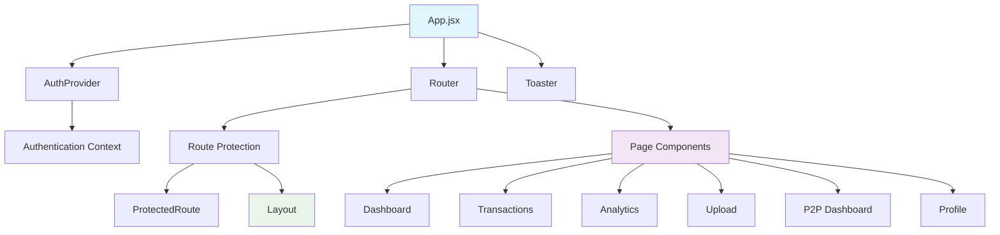
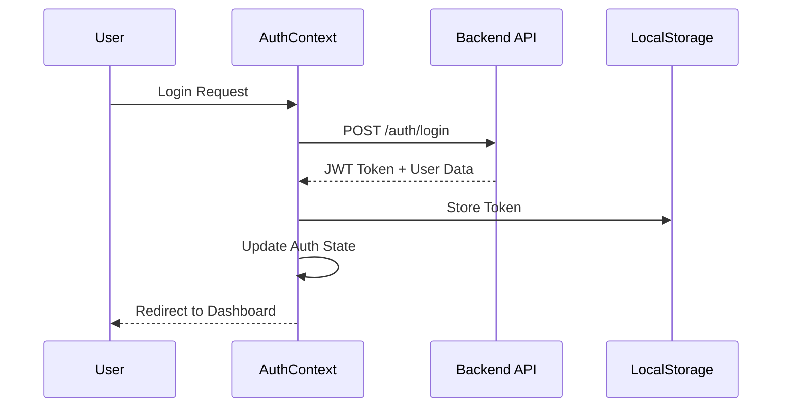
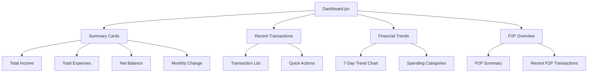
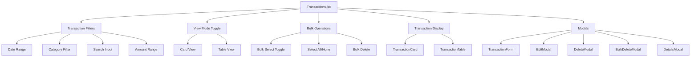
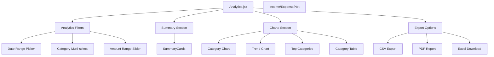
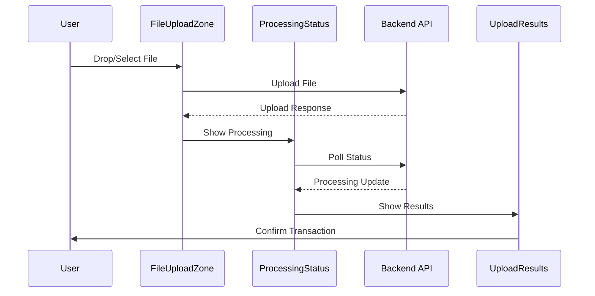
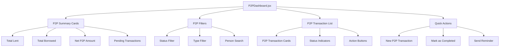
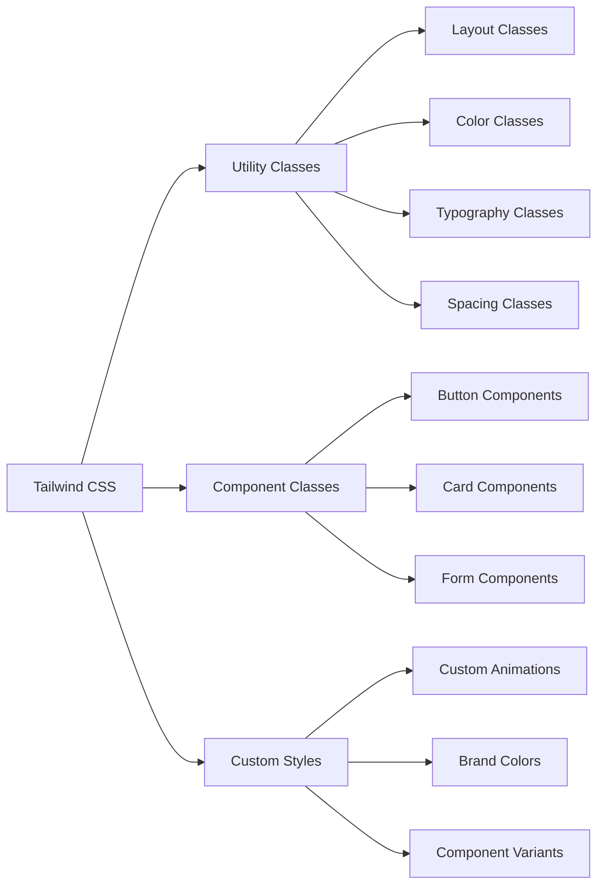
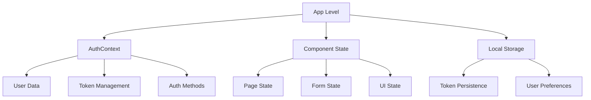

# 🎨 Frontend Architecture & Components

## 🏗️ React Application Structure



## 📁 Component Hierarchy

### Main Application Structure
```
src/
├── App.jsx                    # Root component
├── main.jsx                   # React app entry point
├── index.css                  # Global styles
├── components/                # Reusable components
│   ├── Layout.jsx            # Main layout wrapper
│   ├── LoadingSpinner.jsx    # Loading indicator
│   ├── ProtectedRoute.jsx    # Route protection
│   ├── P2PAnalytics.jsx      # P2P analytics component
│   ├── Analytics/            # Analytics components
│   └── Upload/               # Upload components
├── pages/                    # Page components
│   ├── Dashboard.jsx         # Main dashboard
│   ├── Transactions.jsx      # Transaction management
│   ├── Analytics.jsx         # Analytics page
│   ├── Upload.jsx           # File upload page
│   ├── Login.jsx            # Authentication
│   ├── Register.jsx         # User registration
│   ├── Profile.jsx          # User profile
│   ├── Dashboard/           # Dashboard components
│   ├── Transaction/         # Transaction components
│   └── P2P/                 # P2P components
├── context/                 # React Context providers
│   └── AuthContext.jsx     # Authentication context
└── utils/                   # Utility functions
    └── api.js              # API client
```

## 🔧 Core Components

### App Component Architecture
```mermaid
flowchart TD
    A[App.jsx] --> B[AuthProvider Wrapper]
    B --> C[Router Configuration]
    C --> D[Public Routes]
    C --> E[Protected Routes]
    
    D --> D1[/login]
    D --> D2[/register]
    
    E --> E1[Layout Wrapper]
    E1 --> E2[Navigation]
    E1 --> E3[Main Content]
    
    E3 --> F[Route Components]
    F --> F1[Dashboard]
    F --> F2[Transactions]
    F --> F3[Analytics]
    F --> F4[Upload]
    F --> F5[P2P Dashboard]
    F --> F6[Profile]
```

### Layout Component
```jsx
const Layout = ({ children }) => {
  return (
    <div className="min-h-screen bg-gray-50">
      <Navigation />
      <main className="container mx-auto px-4 py-6">
        {children}
      </main>
    </div>
  );
};
```

## 🔐 Authentication System

### Auth Context Provider


### Auth Context Implementation
```jsx
const AuthContext = createContext();

export const AuthProvider = ({ children }) => {
  const [user, setUser] = useState(null);
  const [loading, setLoading] = useState(true);
  const [token, setToken] = useState(localStorage.getItem('token'));

  const login = async (email, password) => {
    const response = await api.post('/auth/login', { email, password });
    const { token, user } = response.data;
    
    localStorage.setItem('token', token);
    setToken(token);
    setUser(user);
    
    return { success: true };
  };

  const logout = () => {
    localStorage.removeItem('token');
    setToken(null);
    setUser(null);
  };

  return (
    <AuthContext.Provider value={{ 
      user, 
      token, 
      login, 
      logout, 
      loading 
    }}>
      {children}
    </AuthContext.Provider>
  );
};
```

## 📊 Dashboard Components

### Dashboard Layout


### Dashboard Sub-Components
```jsx
// Dashboard/SpendingAndP2POverview.jsx
const SpendingAndP2POverview = () => {
  return (
    <div className="grid grid-cols-1 lg:grid-cols-2 gap-6">
      <SpendingByCategory />
      <P2PSummary />
    </div>
  );
};

// Dashboard/RecentTransactions.jsx
const RecentTransactions = ({ transactions, onViewAll }) => {
  return (
    <div className="bg-white rounded-lg shadow-sm p-6">
      <h3 className="text-lg font-semibold mb-4">Recent Transactions</h3>
      {transactions.map(transaction => (
        <TransactionCard key={transaction._id} transaction={transaction} />
      ))}
    </div>
  );
};
```

## 💰 Transaction Management

### Transaction Components Architecture


### Transaction State Management
```jsx
const Transactions = () => {
  // Core state
  const [transactions, setTransactions] = useState([]);
  const [loading, setLoading] = useState(true);
  const [filters, setFilters] = useState({
    page: 1,
    limit: 20,
    type: '',
    category: '',
    startDate: '',
    endDate: '',
    search: ''
  });

  // UI state
  const [viewMode, setViewMode] = useState('card');
  const [showForm, setShowForm] = useState(false);
  
  // Bulk operations state
  const [selectedTransactions, setSelectedTransactions] = useState([]);
  const [bulkSelectMode, setBulkSelectMode] = useState(false);
  const [showBulkDeleteModal, setShowBulkDeleteModal] = useState(false);

  // Modal state
  const [editingTransaction, setEditingTransaction] = useState(null);
  const [deletingTransaction, setDeletingTransaction] = useState(null);
  const [detailsTransaction, setDetailsTransaction] = useState(null);
};
```

### Transaction Card Component
```jsx
const TransactionCard = ({
  transaction,
  isSelected = false,
  onToggleSelect,
  bulkSelectMode = false,
  onViewDetails,
  onEdit,
  onDelete
}) => {
  const handleCardClick = (e) => {
    if (bulkSelectMode) {
      e.preventDefault();
      onToggleSelect && onToggleSelect(transaction);
    } else {
      onViewDetails && onViewDetails(transaction);
    }
  };

  return (
    <div
      className={`bg-white border rounded-lg p-4 cursor-pointer transition-all ${
        bulkSelectMode 
          ? isSelected 
            ? 'border-blue-500 bg-blue-50 shadow-md' 
            : 'border-gray-200 hover:border-gray-300'
          : 'border-gray-200 hover:bg-gray-50'
      }`}
      onClick={handleCardClick}
    >
      {/* Selection checkbox for bulk mode */}
      {bulkSelectMode && (
        <div className="flex items-center mb-3">
          <input
            type="checkbox"
            checked={isSelected}
            onChange={() => onToggleSelect(transaction)}
            className="mr-2"
          />
        </div>
      )}
      
      {/* Transaction content */}
      <div className="flex justify-between items-start mb-2">
        <div>
          <p className="font-medium text-gray-900">
            {transaction.description || "No description"}
          </p>
          <p className="text-sm text-gray-500">{transaction.category}</p>
        </div>
        <span className={`badge ${transaction.type === 'income' ? 'badge-green' : 'badge-red'}`}>
          {transaction.type}
        </span>
      </div>
      
      {/* Actions */}
      {!bulkSelectMode && (
        <div className="flex items-center justify-between">
          <span className="text-sm text-gray-500">
            {formatDate(transaction.date)}
          </span>
          <div className="flex items-center space-x-2">
            <span className={`font-medium ${
              transaction.type === 'income' ? 'text-green-600' : 'text-red-600'
            }`}>
              {transaction.type === 'income' ? '+' : '-'}
              {formatCurrency(transaction.amount)}
            </span>
            <button onClick={() => onEdit(transaction)}>Edit</button>
            <button onClick={() => onDelete(transaction)}>Delete</button>
          </div>
        </div>
      )}
    </div>
  );
};
```

## 📈 Analytics Components

### Analytics Page Structure


### Chart Components
```jsx
// Analytics/CategoryChart.jsx
const CategoryChart = ({ data, type = 'pie' }) => {
  return (
    <div className="bg-white rounded-lg shadow-sm p-6">
      <h3 className="text-lg font-semibold mb-4">Category Breakdown</h3>
      <ResponsiveContainer width="100%" height={300}>
        <PieChart>
          <Pie
            data={data}
            dataKey="amount"
            nameKey="category"
            cx="50%"
            cy="50%"
            outerRadius={80}
            fill="#8884d8"
            label={({ name, percent }) => `${name} ${(percent * 100).toFixed(0)}%`}
          >
            {data.map((entry, index) => (
              <Cell key={`cell-${index}`} fill={COLORS[index % COLORS.length]} />
            ))}
          </Pie>
          <Tooltip formatter={(value) => formatCurrency(value)} />
        </PieChart>
      </ResponsiveContainer>
    </div>
  );
};

// Analytics/TrendChart.jsx
const TrendChart = ({ data }) => {
  return (
    <div className="bg-white rounded-lg shadow-sm p-6">
      <h3 className="text-lg font-semibold mb-4">Spending Trends</h3>
      <ResponsiveContainer width="100%" height={300}>
        <LineChart data={data}>
          <CartesianGrid strokeDasharray="3 3" />
          <XAxis dataKey="date" />
          <YAxis />
          <Tooltip formatter={(value) => formatCurrency(value)} />
          <Legend />
          <Line type="monotone" dataKey="income" stroke="#10b981" strokeWidth={2} />
          <Line type="monotone" dataKey="expenses" stroke="#ef4444" strokeWidth={2} />
        </LineChart>
      </ResponsiveContainer>
    </div>
  );
};
```

## 📤 Upload Components

### Upload Flow Architecture


### Upload Components
```jsx
// Upload/FileUploadZone.jsx
const FileUploadZone = ({ onFileUpload, uploading }) => {
  const [dragActive, setDragActive] = useState(false);

  const handleDrop = (e) => {
    e.preventDefault();
    setDragActive(false);
    const files = e.dataTransfer.files;
    if (files[0]) {
      onFileUpload(files[0]);
    }
  };

  return (
    <div
      className={`border-2 border-dashed rounded-lg p-8 text-center transition-colors ${
        dragActive 
          ? 'border-blue-400 bg-blue-50' 
          : 'border-gray-300 hover:border-gray-400'
      }`}
      onDrop={handleDrop}
      onDragOver={(e) => e.preventDefault()}
      onDragEnter={() => setDragActive(true)}
      onDragLeave={() => setDragActive(false)}
    >
      {uploading ? (
        <div className="flex flex-col items-center">
          <LoadingSpinner />
          <p className="mt-2 text-gray-600">Uploading...</p>
        </div>
      ) : (
        <>
          <FaCloudUploadAlt className="mx-auto h-12 w-12 text-gray-400" />
          <p className="mt-2 text-lg text-gray-600">
            Drop your receipt here or{' '}
            <button className="text-blue-600 hover:text-blue-700">
              browse files
            </button>
          </p>
          <p className="text-sm text-gray-500 mt-1">
            Support: PDF, JPG, PNG (Max 10MB)
          </p>
        </>
      )}
    </div>
  );
};
```

## 🤝 P2P Components

### P2P Dashboard Layout


## 🎨 Styling & UI Framework

### Tailwind CSS Implementation


### Responsive Design Breakpoints
```css
/* Tailwind CSS Breakpoints */
sm: 640px    /* Small devices */
md: 768px    /* Medium devices */
lg: 1024px   /* Large devices */
xl: 1280px   /* Extra large devices */
2xl: 1536px  /* 2X large devices */
```

### Common CSS Classes
```css
/* Button Styles */
.btn-primary {
  @apply bg-blue-600 text-white px-4 py-2 rounded-md hover:bg-blue-700 transition-colors;
}

.btn-secondary {
  @apply bg-gray-100 text-gray-700 px-4 py-2 rounded-md hover:bg-gray-200 transition-colors;
}

/* Card Styles */
.card {
  @apply bg-white rounded-lg shadow-sm border border-gray-200 p-6;
}

/* Form Styles */
.form-input {
  @apply w-full px-3 py-2 border border-gray-300 rounded-md focus:outline-none focus:ring-2 focus:ring-blue-500;
}
```

## 🔄 State Management

### React Context Usage


### State Management Pattern
- ✅ **React Context** for global authentication state
- ✅ **useState** for component-level state
- ✅ **useEffect** for side effects and data fetching
- ✅ **Custom hooks** for reusable logic
- ✅ **Local Storage** for persistence

## 🚀 Performance Optimizations

### Code Splitting & Lazy Loading
```jsx
// Lazy loaded pages
const Dashboard = lazy(() => import('./pages/Dashboard'));
const Transactions = lazy(() => import('./pages/Transactions'));
const Analytics = lazy(() => import('./pages/Analytics'));

// Route implementation with Suspense
<Suspense fallback={<LoadingSpinner />}>
  <Routes>
    <Route path="/" element={<Dashboard />} />
    <Route path="/transactions" element={<Transactions />} />
    <Route path="/analytics" element={<Analytics />} />
  </Routes>
</Suspense>
```

### Optimization Techniques
- ✅ **React.memo** for preventing unnecessary re-renders
- ✅ **useMemo** for expensive calculations
- ✅ **useCallback** for stable function references
- ✅ **Virtual scrolling** for large transaction lists
- ✅ **Image optimization** with lazy loading
- ✅ **Bundle splitting** with Vite

---

*This frontend architecture provides a scalable, maintainable, and performant React application with modern development practices.*