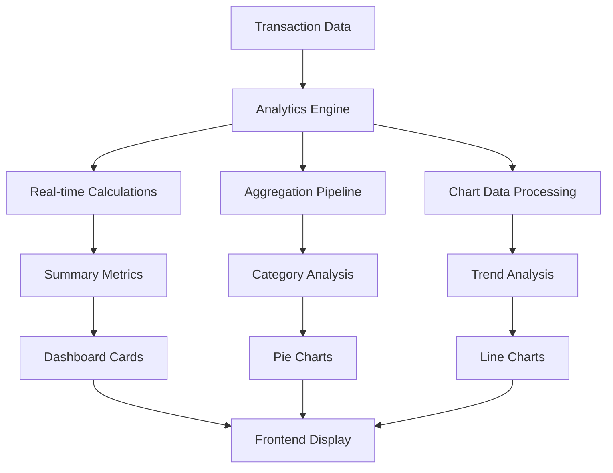
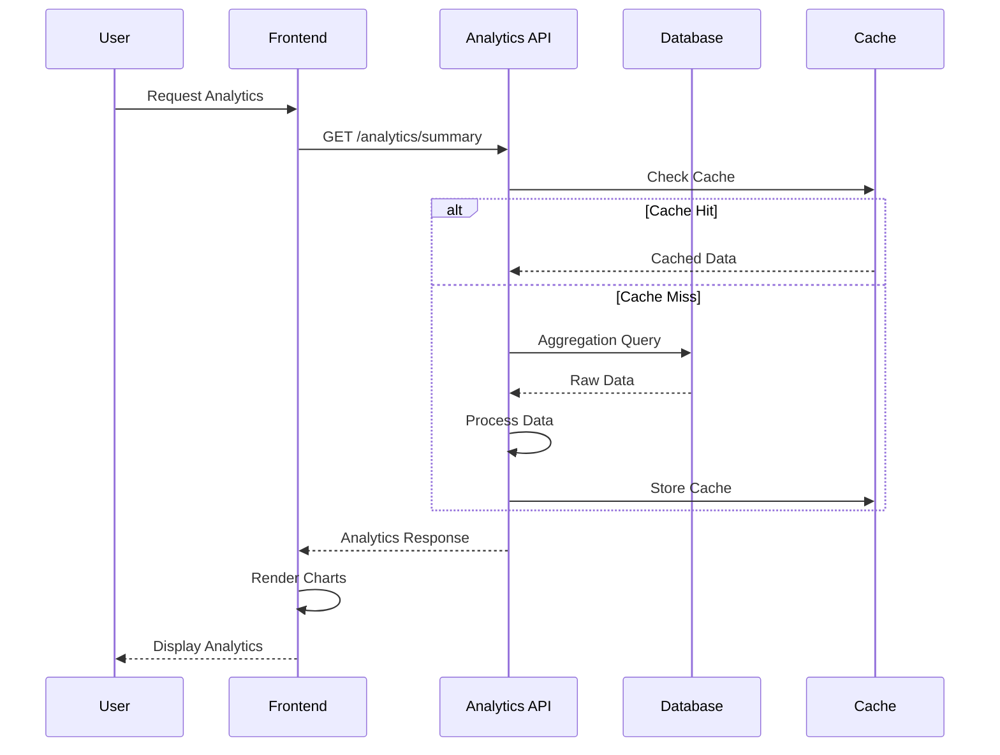
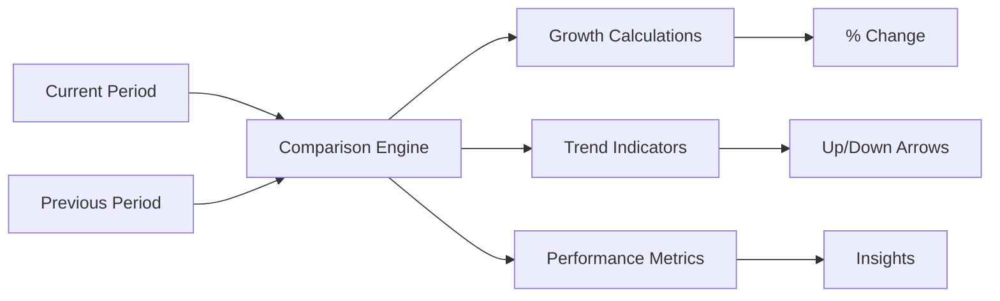
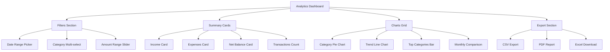

# 📈 Analytics & Reporting Engine

## 📊 Analytics Overview



## 🎯 Analytics Features

### Core Analytics Capabilities
- ✅ **Financial Summary**: Income, expenses, net balance
- ✅ **Category Analysis**: Spending breakdown by categories
- ✅ **Trend Analysis**: Time-series data with charts
- ✅ **Comparative Analysis**: Month-over-month comparisons
- ✅ **P2P Analytics**: Lending/borrowing insights
- ✅ **Custom Filters**: Date range, category, amount filters
- ✅ **Export Capabilities**: CSV, Excel, PDF reports

### Analytics Data Flow


## 💰 Financial Summary Analytics

### Summary Calculation Engine
```javascript
// backend/src/controllers/analyticsController.js
export const getSummary = async (req, res) => {
    try {
        const userId = req.user._id;
        const { startDate, endDate, categories, type } = req.query;
        
        const filters = buildFilters(userId, req.query);
        
        const summary = await Transaction.aggregate([
            { $match: filters },
            {
                $group: {
                    _id: null,
                    totalIncome: {
                        $sum: {
                            $cond: [{ $eq: ["$type", "income"] }, "$amount", 0]
                        }
                    },
                    totalExpenses: {
                        $sum: {
                            $cond: [{ $eq: ["$type", "expense"] }, "$amount", 0]
                        }
                    },
                    transactionCount: { $sum: 1 },
                    averageTransaction: { $avg: "$amount" }
                }
            },
            {
                $project: {
                    _id: 0,
                    totalIncome: { $round: ["$totalIncome", 2] },
                    totalExpenses: { $round: ["$totalExpenses", 2] },
                    netIncome: {
                        $round: [{ $subtract: ["$totalIncome", "$totalExpenses"] }, 2]
                    },
                    transactionCount: 1,
                    averageTransaction: { $round: ["$averageTransaction", 2] }
                }
            }
        ]);

        res.json({
            summary: summary[0] || {
                totalIncome: 0,
                totalExpenses: 0,
                netIncome: 0,
                transactionCount: 0,
                averageTransaction: 0
            }
        });
    } catch (error) {
        res.status(500).json({ error: 'Failed to get summary' });
    }
};
```

### Summary Cards Component
```jsx
// frontend/src/components/Analytics/SummaryCards.jsx
const SummaryCards = ({ summary, loading }) => {
    const cards = [
        {
            title: 'Total Income',
            value: summary?.totalIncome || 0,
            icon: 'TrendingUp',
            color: 'green',
            change: '+12.5%'
        },
        {
            title: 'Total Expenses', 
            value: summary?.totalExpenses || 0,
            icon: 'TrendingDown',
            color: 'red',
            change: '-3.2%'
        },
        {
            title: 'Net Balance',
            value: summary?.netIncome || 0,
            icon: 'DollarSign',
            color: summary?.netIncome >= 0 ? 'green' : 'red',
            change: '+8.7%'
        },
        {
            title: 'Transactions',
            value: summary?.transactionCount || 0,
            icon: 'FileText',
            color: 'blue',
            change: '+15'
        }
    ];

    return (
        <div className="grid grid-cols-1 md:grid-cols-2 lg:grid-cols-4 gap-6 mb-8">
            {cards.map((card, index) => (
                <SummaryCard key={index} {...card} loading={loading} />
            ))}
        </div>
    );
};
```

## 🏷️ Category Analysis

### Category Breakdown Query
```javascript
// Category analysis aggregation
export const getCategoryAnalysis = async (req, res) => {
    try {
        const userId = req.user._id;
        const filters = buildFilters(userId, req.query);
        
        const categoryData = await Transaction.aggregate([
            { $match: filters },
            {
                $group: {
                    _id: "$category",
                    totalAmount: { $sum: "$amount" },
                    transactionCount: { $sum: 1 },
                    averageAmount: { $avg: "$amount" },
                    minAmount: { $min: "$amount" },
                    maxAmount: { $max: "$amount" }
                }
            },
            {
                $project: {
                    category: "$_id",
                    totalAmount: { $round: ["$totalAmount", 2] },
                    transactionCount: 1,
                    averageAmount: { $round: ["$averageAmount", 2] },
                    minAmount: { $round: ["$minAmount", 2] },
                    maxAmount: { $round: ["$maxAmount", 2] }
                }
            },
            { $sort: { totalAmount: -1 } }
        ]);

        // Calculate percentages
        const totalSpent = categoryData.reduce((sum, cat) => sum + cat.totalAmount, 0);
        const categoriesWithPercentage = categoryData.map(cat => ({
            ...cat,
            percentage: ((cat.totalAmount / totalSpent) * 100).toFixed(1)
        }));

        res.json({
            categories: categoriesWithPercentage,
            totalAmount: totalSpent
        });
    } catch (error) {
        res.status(500).json({ error: 'Failed to get category analysis' });
    }
};
```

### Category Chart Component
```jsx
// frontend/src/components/Analytics/CategoryChart.jsx
const CategoryChart = ({ data, type = 'pie' }) => {
    const COLORS = ['#0088FE', '#00C49F', '#FFBB28', '#FF8042', '#8884D8'];
    
    const renderCustomLabel = ({ cx, cy, midAngle, innerRadius, outerRadius, percent }) => {
        const RADIAN = Math.PI / 180;
        const radius = innerRadius + (outerRadius - innerRadius) * 0.5;
        const x = cx + radius * Math.cos(-midAngle * RADIAN);
        const y = cy + radius * Math.sin(-midAngle * RADIAN);

        return (
            <text
                x={x}
                y={y}
                fill="white"
                textAnchor={x > cx ? 'start' : 'end'}
                dominantBaseline="central"
                fontSize={12}
                fontWeight="bold"
            >
                {`${(percent * 100).toFixed(0)}%`}
            </text>
        );
    };

    return (
        <div className="bg-white rounded-lg shadow-sm p-6">
            <h3 className="text-lg font-semibold mb-4">Category Breakdown</h3>
            <ResponsiveContainer width="100%" height={300}>
                {type === 'pie' ? (
                    <PieChart>
                        <Pie
                            data={data}
                            cx="50%"
                            cy="50%"
                            labelLine={false}
                            label={renderCustomLabel}
                            outerRadius={80}
                            fill="#8884d8"
                            dataKey="totalAmount"
                        >
                            {data.map((entry, index) => (
                                <Cell key={`cell-${index}`} fill={COLORS[index % COLORS.length]} />
                            ))}
                        </Pie>
                        <Tooltip formatter={(value) => formatCurrency(value)} />
                        <Legend />
                    </PieChart>
                ) : (
                    <BarChart data={data}>
                        <CartesianGrid strokeDasharray="3 3" />
                        <XAxis dataKey="category" />
                        <YAxis />
                        <Tooltip formatter={(value) => formatCurrency(value)} />
                        <Bar dataKey="totalAmount" fill="#8884d8" />
                    </BarChart>
                )}
            </ResponsiveContainer>
        </div>
    );
};
```

I'll continue with the trend analysis in the next message since this is getting quite long.

## 📈 Trend Analysis

### Time Series Data Processing
```javascript
// Trend analysis aggregation
export const getTrendAnalysis = async (req, res) => {
    try {
        const userId = req.user._id;
        const { groupBy = 'day' } = req.query;
        const filters = buildFilters(userId, req.query);
        
        const groupFormat = {
            day: { $dateToString: { format: "%Y-%m-%d", date: "$date" } },
            week: { $dateToString: { format: "%Y-W%V", date: "$date" } },
            month: { $dateToString: { format: "%Y-%m", date: "$date" } }
        };

        const trendData = await Transaction.aggregate([
            { $match: filters },
            {
                $group: {
                    _id: groupFormat[groupBy],
                    totalIncome: {
                        $sum: { $cond: [{ $eq: ["$type", "income"] }, "$amount", 0] }
                    },
                    totalExpenses: {
                        $sum: { $cond: [{ $eq: ["$type", "expense"] }, "$amount", 0] }
                    },
                    transactionCount: { $sum: 1 }
                }
            },
            {
                $project: {
                    date: "$_id",
                    totalIncome: { $round: ["$totalIncome", 2] },
                    totalExpenses: { $round: ["$totalExpenses", 2] },
                    netAmount: {
                        $round: [{ $subtract: ["$totalIncome", "$totalExpenses"] }, 2]
                    },
                    transactionCount: 1
                }
            },
            { $sort: { date: 1 } }
        ]);

        res.json({ trends: trendData });
    } catch (error) {
        res.status(500).json({ error: 'Failed to get trend analysis' });
    }
};
```

### Trend Chart Component
```jsx
// frontend/src/components/Analytics/TrendChart.jsx
const TrendChart = ({ data, groupBy = 'day' }) => {
    const formatXAxisLabel = (tickItem) => {
        if (groupBy === 'day') {
            return new Date(tickItem).toLocaleDateString('en-IN', { 
                month: 'short', 
                day: 'numeric' 
            });
        } else if (groupBy === 'month') {
            return new Date(tickItem + '-01').toLocaleDateString('en-IN', { 
                month: 'short', 
                year: 'numeric' 
            });
        }
        return tickItem;
    };

    return (
        <div className="bg-white rounded-lg shadow-sm p-6">
            <h3 className="text-lg font-semibold mb-4">Spending Trends</h3>
            <ResponsiveContainer width="100%" height={400}>
                <LineChart data={data}>
                    <CartesianGrid strokeDasharray="3 3" />
                    <XAxis 
                        dataKey="date" 
                        tickFormatter={formatXAxisLabel}
                        interval="preserveStartEnd"
                    />
                    <YAxis tickFormatter={(value) => `₹${value}`} />
                    <Tooltip 
                        labelFormatter={(label) => formatXAxisLabel(label)}
                        formatter={(value, name) => [
                            formatCurrency(value),
                            name === 'totalIncome' ? 'Income' : 
                            name === 'totalExpenses' ? 'Expenses' : 'Net'
                        ]}
                    />
                    <Legend />
                    <Line 
                        type="monotone" 
                        dataKey="totalIncome" 
                        stroke="#10b981" 
                        strokeWidth={2}
                        name="Income"
                        dot={{ fill: '#10b981' }}
                    />
                    <Line 
                        type="monotone" 
                        dataKey="totalExpenses" 
                        stroke="#ef4444" 
                        strokeWidth={2}
                        name="Expenses"
                        dot={{ fill: '#ef4444' }}
                    />
                    <Line 
                        type="monotone" 
                        dataKey="netAmount" 
                        stroke="#3b82f6" 
                        strokeWidth={2}
                        name="Net"
                        dot={{ fill: '#3b82f6' }}
                    />
                </LineChart>
            </ResponsiveContainer>
        </div>
    );
};
```

## 🤝 P2P Analytics

### P2P Summary Analysis
```javascript
// P2P analytics aggregation
export const getP2PSummary = async (req, res) => {
    try {
        const userId = req.user._id;
        
        const p2pSummary = await Transaction.aggregate([
            {
                $match: {
                    userId,
                    'personToPerson.type': { $exists: true }
                }
            },
            {
                $group: {
                    _id: '$personToPerson.type',
                    totalAmount: { $sum: '$amount' },
                    count: { $sum: 1 },
                    pendingAmount: {
                        $sum: {
                            $cond: [
                                { $eq: ['$personToPerson.status', 'pending'] },
                                '$amount',
                                0
                            ]
                        }
                    },
                    completedAmount: {
                        $sum: {
                            $cond: [
                                { $eq: ['$personToPerson.status', 'completed'] },
                                '$amount',
                                0
                            ]
                        }
                    }
                }
            },
            {
                $project: {
                    type: '$_id',
                    totalAmount: { $round: ['$totalAmount', 2] },
                    count: 1,
                    pendingAmount: { $round: ['$pendingAmount', 2] },
                    completedAmount: { $round: ['$completedAmount', 2] }
                }
            }
        ]);

        // Calculate totals
        let totalLent = 0, totalBorrowed = 0;
        let pendingLent = 0, pendingBorrowed = 0;

        p2pSummary.forEach(item => {
            if (item.type === 'lent') {
                totalLent = item.totalAmount;
                pendingLent = item.pendingAmount;
            } else if (item.type === 'borrowed') {
                totalBorrowed = item.totalAmount;
                pendingBorrowed = item.pendingAmount;
            }
        });

        res.json({
            summary: {
                totalLent,
                totalBorrowed,
                netAmount: totalLent - totalBorrowed,
                pendingLent,
                pendingBorrowed,
                breakdown: p2pSummary
            }
        });
    } catch (error) {
        res.status(500).json({ error: 'Failed to get P2P summary' });
    }
};
```

## 📊 Export & Reporting

### CSV Export Implementation
```javascript
// Export analytics to CSV
export const exportAnalytics = async (req, res) => {
    try {
        const userId = req.user._id;
        const { format = 'csv', reportType = 'transactions' } = req.query;
        const filters = buildFilters(userId, req.query);

        if (reportType === 'transactions') {
            const transactions = await Transaction.find(filters)
                .populate('userId', 'name email')
                .sort({ date: -1 });

            if (format === 'csv') {
                const csvData = transactions.map(t => ({
                    Date: t.date.toISOString().split('T')[0],
                    Type: t.type,
                    Amount: t.amount,
                    Category: t.category,
                    Description: t.description || '',
                    Source: t.source || 'manual'
                }));

                const csv = convertToCSV(csvData);
                res.setHeader('Content-Type', 'text/csv');
                res.setHeader('Content-Disposition', 'attachment; filename=transactions.csv');
                res.send(csv);
            }
        }
    } catch (error) {
        res.status(500).json({ error: 'Export failed' });
    }
};

const convertToCSV = (data) => {
    if (!data || data.length === 0) return '';
    
    const headers = Object.keys(data[0]);
    const csvRows = [headers.join(',')];
    
    data.forEach(row => {
        const values = headers.map(header => {
            const value = row[header];
            return typeof value === 'string' ? `"${value}"` : value;
        });
        csvRows.push(values.join(','));
    });
    
    return csvRows.join('\n');
};
```

## 🎯 Advanced Analytics Features

### Comparative Analysis


### Monthly Comparison Logic
```javascript
// Monthly comparison analytics
export const getMonthlyComparison = async (req, res) => {
    try {
        const userId = req.user._id;
        const currentMonth = new Date();
        const previousMonth = new Date(currentMonth);
        previousMonth.setMonth(previousMonth.getMonth() - 1);

        const [currentData, previousData] = await Promise.all([
            getMonthlyData(userId, currentMonth),
            getMonthlyData(userId, previousMonth)
        ]);

        const comparison = {
            current: currentData,
            previous: previousData,
            changes: {
                income: calculatePercentageChange(
                    previousData.totalIncome, 
                    currentData.totalIncome
                ),
                expenses: calculatePercentageChange(
                    previousData.totalExpenses, 
                    currentData.totalExpenses
                ),
                transactions: calculatePercentageChange(
                    previousData.transactionCount, 
                    currentData.transactionCount
                )
            }
        };

        res.json({ comparison });
    } catch (error) {
        res.status(500).json({ error: 'Failed to get monthly comparison' });
    }
};

const calculatePercentageChange = (oldValue, newValue) => {
    if (oldValue === 0) return newValue > 0 ? 100 : 0;
    return ((newValue - oldValue) / oldValue) * 100;
};
```

## 🔄 Real-time Analytics Updates

### WebSocket Implementation for Real-time Updates
```javascript
// Real-time analytics updates
class AnalyticsService {
    static async updateRealTimeAnalytics(userId, transactionData) {
        try {
            // Recalculate key metrics
            const updatedSummary = await this.calculateSummary(userId);
            const updatedCategories = await this.calculateCategoryBreakdown(userId);
            
            // Emit to connected clients
            io.to(`user_${userId}`).emit('analyticsUpdate', {
                summary: updatedSummary,
                categories: updatedCategories,
                timestamp: new Date()
            });
        } catch (error) {
            console.error('Real-time analytics update failed:', error);
        }
    }
}

// Usage in transaction controller
export const createTransaction = async (req, res) => {
    try {
        const transaction = new Transaction({
            ...req.body,
            userId: req.user._id
        });
        
        await transaction.save();
        
        // Trigger real-time analytics update
        AnalyticsService.updateRealTimeAnalytics(req.user._id, transaction);
        
        res.status(201).json({ transaction });
    } catch (error) {
        res.status(500).json({ error: 'Failed to create transaction' });
    }
};
```

## 📱 Analytics Dashboard Layout

### Dashboard Component Structure


---

*This analytics system provides comprehensive financial insights with real-time updates and export capabilities.*
