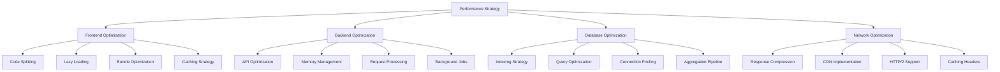
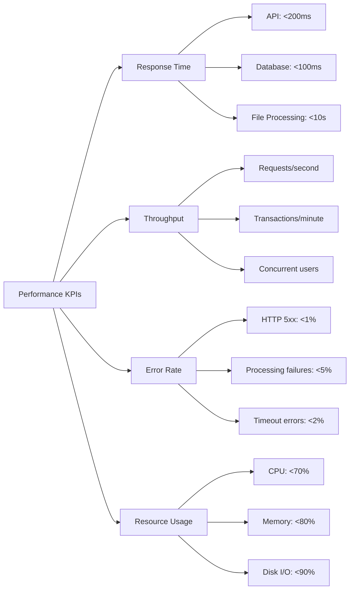

# ⚡ Performance & Optimization

## 🎯 Performance Overview



## 🚀 Frontend Performance

### Code Splitting & Lazy Loading
```jsx
// Route-based code splitting
import { lazy, Suspense } from 'react';
import LoadingSpinner from './components/LoadingSpinner';

// Lazy load page components
const Dashboard = lazy(() => import('./pages/Dashboard'));
const Transactions = lazy(() => import('./pages/Transactions'));
const Analytics = lazy(() => import('./pages/Analytics'));
const Upload = lazy(() => import('./pages/Upload'));

// App component with Suspense
function App() {
    return (
        <Router>
            <Suspense fallback={<LoadingSpinner />}>
                <Routes>
                    <Route path="/" element={<Dashboard />} />
                    <Route path="/transactions" element={<Transactions />} />
                    <Route path="/analytics" element={<Analytics />} />
                    <Route path="/upload" element={<Upload />} />
                </Routes>
            </Suspense>
        </Router>
    );
}
```

### Component Optimization
```jsx
// Memoized transaction card for better performance
import { memo, useMemo, useCallback } from 'react';

const TransactionCard = memo(({ 
    transaction, 
    onEdit, 
    onDelete, 
    isSelected,
    onToggleSelect 
}) => {
    // Memoize formatted values
    const formattedAmount = useMemo(() => {
        return new Intl.NumberFormat('en-IN', {
            style: 'currency',
            currency: 'INR'
        }).format(transaction.amount);
    }, [transaction.amount]);

    const formattedDate = useMemo(() => {
        return new Date(transaction.date).toLocaleDateString('en-IN');
    }, [transaction.date]);

    // Stable callback references
    const handleEdit = useCallback(() => {
        onEdit(transaction);
    }, [onEdit, transaction]);

    const handleDelete = useCallback(() => {
        onDelete(transaction);
    }, [onDelete, transaction]);

    return (
        <div className="transaction-card">
            {/* Card content */}
        </div>
    );
});

// Virtualized list for large transaction datasets
import { FixedSizeList as List } from 'react-window';

const VirtualizedTransactionList = ({ transactions, height = 400 }) => {
    const Row = ({ index, style }) => (
        <div style={style}>
            <TransactionCard transaction={transactions[index]} />
        </div>
    );

    return (
        <List
            height={height}
            itemCount={transactions.length}
            itemSize={120}
            overscanCount={5}
        >
            {Row}
        </List>
    );
};
```

### Bundle Optimization (Vite Configuration)
```javascript
// vite.config.js
import { defineConfig } from 'vite';
import react from '@vitejs/plugin-react';

export default defineConfig({
    plugins: [react()],
    build: {
        // Optimize bundle splitting
        rollupOptions: {
            output: {
                manualChunks: {
                    // Vendor chunks
                    vendor: ['react', 'react-dom'],
                    charts: ['recharts'],
                    icons: ['react-icons', 'lucide-react'],
                    forms: ['react-hook-form'],
                    router: ['react-router-dom']
                }
            }
        },
        // Enable minification
        minify: 'terser',
        terserOptions: {
            compress: {
                drop_console: true,
                drop_debugger: true
            }
        },
        // Source maps for debugging
        sourcemap: false
    },
    // Optimize dev server
    server: {
        port: 3000,
        host: true
    }
});
```

## 🔧 Backend Performance

### API Response Optimization
```javascript
// Response compression middleware
import compression from 'compression';

app.use(compression({
    level: 6, // Compression level (1-9)
    threshold: 1024, // Only compress responses > 1KB
    filter: (req, res) => {
        // Don't compress if client doesn't support it
        if (req.headers['x-no-compression']) {
            return false;
        }
        // Use compression for all other requests
        return compression.filter(req, res);
    }
}));

// Optimized transaction listing with pagination
export const listTransactions = async (req, res) => {
    try {
        const userId = req.user._id;
        const {
            page = 1,
            limit = 20,
            type,
            category,
            startDate,
            endDate,
            search
        } = req.query;

        // Build efficient aggregation pipeline
        const pipeline = [
            // Match stage - use indexes
            {
                $match: {
                    userId: new mongoose.Types.ObjectId(userId),
                    ...(type && { type }),
                    ...(category && { category }),
                    ...(startDate || endDate) && {
                        date: {
                            ...(startDate && { $gte: new Date(startDate) }),
                            ...(endDate && { $lte: new Date(endDate) })
                        }
                    },
                    ...(search && {
                        $or: [
                            { description: { $regex: search, $options: 'i' } },
                            { category: { $regex: search, $options: 'i' } }
                        ]
                    })
                }
            },
            // Sort stage
            { $sort: { date: -1, createdAt: -1 } },
            // Facet for pagination and count
            {
                $facet: {
                    transactions: [
                        { $skip: (page - 1) * limit },
                        { $limit: parseInt(limit) },
                        // Project only needed fields
                        {
                            $project: {
                                type: 1,
                                amount: 1,
                                category: 1,
                                description: 1,
                                date: 1,
                                source: 1,
                                tags: 1
                            }
                        }
                    ],
                    totalCount: [{ $count: "count" }]
                }
            }
        ];

        const [result] = await Transaction.aggregate(pipeline);
        const transactions = result.transactions;
        const total = result.totalCount[0]?.count || 0;

        res.json({
            transactions,
            pagination: {
                currentPage: parseInt(page),
                totalPages: Math.ceil(total / limit),
                totalItems: total,
                itemsPerPage: parseInt(limit)
            }
        });
    } catch (error) {
        res.status(500).json({ error: 'Failed to fetch transactions' });
    }
};
```

### Memory Management
```javascript
// Memory-efficient file processing
class FileProcessor {
    constructor() {
        this.activeProcesses = new Map();
        this.maxConcurrentProcesses = 3;
    }

    async processFile(fileData) {
        // Check memory usage
        const memUsage = process.memoryUsage();
        if (memUsage.heapUsed > 500 * 1024 * 1024) { // 500MB threshold
            // Force garbage collection if available
            if (global.gc) {
                global.gc();
            }
            
            // Wait for memory to free up
            await this.waitForMemory();
        }

        try {
            return await this.performProcessing(fileData);
        } finally {
            // Clean up processing references
            this.cleanup(fileData.id);
        }
    }

    async performProcessing(fileData) {
        // Use streams for large files
        const stream = fs.createReadStream(fileData.path);
        let buffer = Buffer.alloc(0);

        return new Promise((resolve, reject) => {
            stream.on('data', (chunk) => {
                buffer = Buffer.concat([buffer, chunk]);
            });

            stream.on('end', () => {
                // Process buffer and clean up immediately
                this.processBuffer(buffer)
                    .then(resolve)
                    .catch(reject)
                    .finally(() => {
                        buffer = null; // Release memory
                    });
            });

            stream.on('error', reject);
        });
    }
}
```

## 🗃️ Database Performance

### Indexing Strategy
```javascript
// Optimized indexes for common queries
// In Transaction model
transactionSchema.index({ userId: 1, date: -1 }); // Most common query
transactionSchema.index({ userId: 1, type: 1, date: -1 }); // Type filtering
transactionSchema.index({ userId: 1, category: 1, date: -1 }); // Category filtering
transactionSchema.index({ userId: 1, 'personToPerson.type': 1 }); // P2P queries

// Compound index for analytics queries
transactionSchema.index({ 
    userId: 1, 
    date: 1, 
    type: 1, 
    category: 1 
});

// Text index for search functionality
transactionSchema.index({
    description: 'text',
    category: 'text',
    'metadata.merchant': 'text'
});
```

### Connection Pooling
```javascript
// Optimized MongoDB connection
import mongoose from 'mongoose';

const connectDB = async () => {
    try {
        const conn = await mongoose.connect(process.env.MONGODB_URI, {
            // Connection pooling options
            maxPoolSize: 10, // Maximum number of connections
            minPoolSize: 2,  // Minimum number of connections
            maxIdleTimeMS: 30000, // Close connections after 30s of inactivity
            serverSelectionTimeoutMS: 5000, // How long to try connecting
            heartbeatFrequencyMS: 10000, // Heartbeat frequency
            
            // Buffer settings
            bufferMaxEntries: 0, // Disable mongoose buffering
            bufferCommands: false,
            
            // Compression
            compressors: ['snappy', 'zlib'],
            
            // Read preference
            readPreference: 'secondaryPreferred'
        });

        console.log(`📦 MongoDB Connected: ${conn.connection.host}`);
    } catch (error) {
        console.error('Database connection error:', error);
        process.exit(1);
    }
};
```

### Query Optimization
```javascript
// Optimized analytics aggregation with explain
export const getOptimizedCategoryAnalysis = async (userId, filters) => {
    const pipeline = [
        // Stage 1: Match - use compound index
        {
            $match: {
                userId: new mongoose.Types.ObjectId(userId),
                type: 'expense', // Filter early
                ...filters
            }
        },
        // Stage 2: Group by category
        {
            $group: {
                _id: '$category',
                totalAmount: { $sum: '$amount' },
                count: { $sum: 1 },
                avgAmount: { $avg: '$amount' }
            }
        },
        // Stage 3: Sort by total amount
        { $sort: { totalAmount: -1 } },
        // Stage 4: Limit results
        { $limit: 20 }
    ];

    // Add explain for performance monitoring in development
    if (process.env.NODE_ENV === 'development') {
        const explanation = await Transaction.aggregate(pipeline).explain('executionStats');
        console.log('Query execution stats:', explanation);
    }

    return Transaction.aggregate(pipeline);
};
```

I'll continue with caching strategies and monitoring in the next part to keep the response manageable.
## 💾 Caching Strategy

### Redis Caching Implementation
```javascript
// Redis cache setup
import Redis from 'redis';

class CacheService {
    constructor() {
        this.client = Redis.createClient({
            host: process.env.REDIS_HOST || 'localhost',
            port: process.env.REDIS_PORT || 6379,
            password: process.env.REDIS_PASSWORD,
            db: 0,
            maxRetriesPerRequest: 3,
            retryDelayOnFailover: 100,
            lazyConnect: true
        });
        
        this.client.on('error', (err) => {
            console.error('Redis Client Error:', err);
        });
    }

    async get(key) {
        try {
            const data = await this.client.get(key);
            return data ? JSON.parse(data) : null;
        } catch (error) {
            console.error('Cache get error:', error);
            return null;
        }
    }

    async set(key, data, ttl = 300) { // 5 minutes default TTL
        try {
            await this.client.setex(key, ttl, JSON.stringify(data));
        } catch (error) {
            console.error('Cache set error:', error);
        }
    }

    async del(key) {
        try {
            await this.client.del(key);
        } catch (error) {
            console.error('Cache delete error:', error);
        }
    }

    // Cache invalidation patterns
    async invalidateUserCache(userId) {
        const pattern = `user:${userId}:*`;
        const keys = await this.client.keys(pattern);
        if (keys.length > 0) {
            await this.client.del(keys);
        }
    }
}

// Cache middleware for analytics
const cacheMiddleware = (ttl = 300) => {
    return async (req, res, next) => {
        const cacheKey = `analytics:${req.user._id}:${JSON.stringify(req.query)}`;
        
        try {
            const cachedData = await cacheService.get(cacheKey);
            if (cachedData) {
                return res.json(cachedData);
            }
            
            // Store original res.json
            const originalJson = res.json;
            res.json = function(data) {
                // Cache the response
                cacheService.set(cacheKey, data, ttl);
                originalJson.call(this, data);
            };
            
            next();
        } catch (error) {
            next(); // Continue without caching on error
        }
    };
};

// Usage in routes
router.get('/analytics/summary', 
    auth, 
    cacheMiddleware(600), // 10 minutes cache
    getSummary
);
```

### Browser Caching
```javascript
// HTTP caching headers
app.use((req, res, next) => {
    if (req.path.startsWith('/api/')) {
        // API responses - short cache
        res.set('Cache-Control', 'private, max-age=300'); // 5 minutes
    } else if (req.path.match(/\.(css|js|png|jpg|jpeg|gif|ico|svg)$/)) {
        // Static assets - long cache
        res.set('Cache-Control', 'public, max-age=31536000'); // 1 year
        res.set('ETag', generateETag(req.path));
    } else {
        // HTML - no cache
        res.set('Cache-Control', 'no-cache, no-store, must-revalidate');
    }
    next();
});
```

## 📊 Performance Monitoring

### API Response Time Monitoring
```javascript
// Performance monitoring middleware
const performanceMonitor = (req, res, next) => {
    const startTime = Date.now();
    
    res.on('finish', () => {
        const duration = Date.now() - startTime;
        const route = req.route?.path || req.path;
        
        // Log slow requests
        if (duration > 1000) {
            console.warn(`Slow request detected: ${req.method} ${route} - ${duration}ms`);
        }
        
        // Store metrics
        storeMetric({
            method: req.method,
            route,
            duration,
            statusCode: res.statusCode,
            timestamp: new Date()
        });
    });
    
    next();
};

// Memory usage monitoring
const monitorMemory = () => {
    setInterval(() => {
        const memUsage = process.memoryUsage();
        const cpuUsage = process.cpuUsage();
        
        console.log('Performance Metrics:', {
            heapUsed: `${Math.round(memUsage.heapUsed / 1024 / 1024)}MB`,
            heapTotal: `${Math.round(memUsage.heapTotal / 1024 / 1024)}MB`,
            external: `${Math.round(memUsage.external / 1024 / 1024)}MB`,
            rss: `${Math.round(memUsage.rss / 1024 / 1024)}MB`,
            cpuUser: cpuUsage.user,
            cpuSystem: cpuUsage.system
        });
        
        // Alert if memory usage is high
        if (memUsage.heapUsed > 500 * 1024 * 1024) { // 500MB
            console.warn('High memory usage detected');
            if (global.gc) {
                global.gc();
            }
        }
    }, 30000); // Every 30 seconds
};
```

### Database Query Performance
```javascript
// Query performance monitoring
mongoose.plugin((schema) => {
    schema.pre(/^find/, function() {
        this.start = Date.now();
    });

    schema.post(/^find/, function() {
        if (this.start) {
            const duration = Date.now() - this.start;
            if (duration > 100) { // Log queries taking more than 100ms
                console.warn(`Slow query detected: ${this.getQuery()} - ${duration}ms`);
            }
        }
    });
});

// Aggregation performance tracking
const trackAggregationPerformance = async (pipeline, collectionName) => {
    const startTime = Date.now();
    
    try {
        const result = await mongoose.model(collectionName).aggregate(pipeline);
        const duration = Date.now() - startTime;
        
        console.log(`Aggregation performance: ${collectionName} - ${duration}ms`);
        
        return result;
    } catch (error) {
        console.error('Aggregation error:', error);
        throw error;
    }
};
```

## 🔄 Background Job Processing

### Queue Implementation for Heavy Tasks
```javascript
// Background job processor
import Queue from 'bull';

const fileProcessingQueue = new Queue('file processing', {
    redis: {
        host: process.env.REDIS_HOST,
        port: process.env.REDIS_PORT,
        password: process.env.REDIS_PASSWORD
    }
});

// Process files in background
fileProcessingQueue.process('processReceipt', 5, async (job) => {
    const { fileId, filePath, userId } = job.data;
    
    try {
        // Update status to processing
        await Receipt.findByIdAndUpdate(fileId, { 
            status: 'processing',
            processedAt: new Date()
        });
        
        // Perform OCR and AI processing
        const ocrResult = await ocrService.processImage(filePath);
        const aiResult = await geminiService.analyzeReceiptText(ocrResult.text);
        
        // Update with results
        await Receipt.findByIdAndUpdate(fileId, {
            status: 'completed',
            ocrResult,
            aiAnalysis: aiResult,
            processedAt: new Date()
        });
        
        // Invalidate user cache
        await cacheService.invalidateUserCache(userId);
        
        // Notify user via WebSocket
        io.to(`user_${userId}`).emit('fileProcessed', {
            fileId,
            status: 'completed',
            extractedData: aiResult.extractedData
        });
        
        return { success: true, fileId };
    } catch (error) {
        // Update status to failed
        await Receipt.findByIdAndUpdate(fileId, {
            status: 'failed',
            error: error.message,
            processedAt: new Date()
        });
        
        throw error;
    }
});

// Add job to queue
export const queueFileProcessing = async (fileData) => {
    const job = await fileProcessingQueue.add('processReceipt', {
        fileId: fileData._id,
        filePath: fileData.path,
        userId: fileData.userId
    }, {
        attempts: 3,
        backoff: {
            type: 'exponential',
            delay: 2000
        },
        removeOnComplete: 10,
        removeOnFail: 5
    });
    
    return job.id;
};
```

## 📈 Performance Metrics & KPIs

### Key Performance Indicators


### Performance Benchmarks
```javascript
// Performance benchmarking
class PerformanceBenchmark {
    static async benchmarkTransactionQuery() {
        const userId = new mongoose.Types.ObjectId();
        const iterations = 1000;
        const startTime = Date.now();
        
        for (let i = 0; i < iterations; i++) {
            await Transaction.find({ userId }).limit(20).lean();
        }
        
        const endTime = Date.now();
        const avgTime = (endTime - startTime) / iterations;
        
        console.log(`Transaction query benchmark: ${avgTime.toFixed(2)}ms avg`);
        return avgTime;
    }
    
    static async benchmarkAnalyticsAggregation() {
        const userId = new mongoose.Types.ObjectId();
        const iterations = 100;
        const startTime = Date.now();
        
        const pipeline = [
            { $match: { userId } },
            { $group: { _id: '$category', total: { $sum: '$amount' } } },
            { $sort: { total: -1 } }
        ];
        
        for (let i = 0; i < iterations; i++) {
            await Transaction.aggregate(pipeline);
        }
        
        const endTime = Date.now();
        const avgTime = (endTime - startTime) / iterations;
        
        console.log(`Analytics aggregation benchmark: ${avgTime.toFixed(2)}ms avg`);
        return avgTime;
    }
}
```

## 🎯 Optimization Checklist

### Frontend Optimizations
- ✅ **Code Splitting**: Route-based lazy loading
- ✅ **Component Memoization**: React.memo for expensive components
- ✅ **Virtual Scrolling**: For large transaction lists
- ✅ **Bundle Optimization**: Vendor chunk separation
- ✅ **Image Optimization**: WebP format and lazy loading
- ✅ **Service Workers**: Offline functionality and caching
- ✅ **Prefetching**: Critical route prefetching

### Backend Optimizations
- ✅ **Response Compression**: Gzip compression for API responses
- ✅ **Connection Pooling**: Database connection optimization
- ✅ **Query Optimization**: Efficient aggregation pipelines
- ✅ **Caching**: Redis for frequently accessed data
- ✅ **Background Jobs**: Async processing for heavy tasks
- ✅ **Rate Limiting**: Prevent API abuse
- ✅ **Memory Management**: Garbage collection optimization

### Database Optimizations
- ✅ **Indexing Strategy**: Compound indexes for common queries
- ✅ **Query Optimization**: Efficient aggregation pipelines
- ✅ **Data Pagination**: Limit result sets
- ✅ **Field Projection**: Select only needed fields
- ✅ **Connection Pooling**: Optimized connection settings
- ✅ **Read Replicas**: Distribute read operations

### Monitoring & Alerting
- ✅ **Response Time Monitoring**: Track API performance
- ✅ **Error Rate Tracking**: Monitor application health
- ✅ **Resource Usage**: CPU, memory, disk monitoring
- ✅ **Database Performance**: Query execution time tracking
- ✅ **User Experience**: Real user monitoring
- ✅ **Alerting**: Automated notifications for issues

---

*This performance optimization strategy ensures the application scales efficiently while maintaining excellent user experience.*
