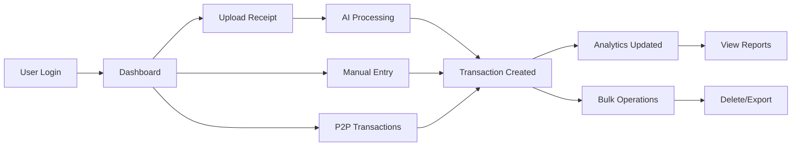

# 📊 Personal Finance Assistant - Complete Project Documentation

## 🎯 Project Overview

A comprehensive personal finance management application with AI-powered receipt processing, real-time analytics, P2P transaction tracking, and bulk operations. Built with modern MERN stack and advanced features for financial data management.

## 📁 Documentation Structure

- [🏗️ **Architecture Overview**](./01-architecture.md) - System design and component architecture
- [🚀 **Features & Functionality**](./02-features.md) - Complete feature breakdown
- [🗄️ **Database Schema**](./03-database-schema.md) - Data models and relationships
- [🔌 **API Documentation**](./04-api-endpoints.md) - Complete API reference
- [🎨 **Frontend Components**](./05-frontend-architecture.md) - React component structure
- [🤖 **AI & Services**](./06-ai-services.md) - OCR, Gemini AI, and processing services
- [🔐 **Security & Authentication**](./07-security.md) - Security implementation details
- [📈 **Analytics & Reporting**](./08-analytics.md) - Analytics engine and visualization
- [⚡ **Performance & Optimization**](./09-performance.md) - Performance considerations
- [🚀 **Deployment Guide**](./10-deployment.md) - Deployment and infrastructure

## 🎥 Quick Demo Flow

## 🛠️ Tech Stack Summary

### Backend
- **Runtime**: Node.js with Express.js
- **Database**: MongoDB with Mongoose ODM
- **Authentication**: JWT tokens with bcrypt
- **AI Services**: Google Gemini AI, Tesseract.js OCR
- **File Processing**: Multer, Sharp, PDF-Parse
- **Security**: Helmet, CORS, Rate Limiting

### Frontend
- **Framework**: React 18 with Vite
- **Routing**: React Router v6
- **Styling**: Tailwind CSS
- **Charts**: Recharts
- **Icons**: Lucide React, React Icons
- **Forms**: React Hook Form
- **Notifications**: React Hot Toast

## 🌟 Key Highlights

- ✅ **AI-Powered Receipt Processing** - Automatic transaction extraction from receipts/PDFs
- ✅ **Real-time Analytics** - Dynamic charts and financial insights
- ✅ **P2P Transaction Management** - Track lending, borrowing, and payments
- ✅ **Bulk Operations** - Multi-select delete, export, and batch processing
- ✅ **Responsive Design** - Mobile-first approach with modern UI
- ✅ **Security First** - JWT authentication, input validation, rate limiting
- ✅ **Performance Optimized** - Database indexing, pagination, caching strategies

## 🎯 Business Value

1. **Time Saving**: Automated receipt processing saves 80% manual entry time
2. **Financial Insights**: Real-time analytics help users understand spending patterns
3. **P2P Management**: Track personal loans and debts effectively
4. **Data Security**: Enterprise-grade security for financial data
5. **Scalability**: Built to handle growing user base and transaction volume

## 📊 Key Metrics

- **Transaction Processing**: ~500ms average for receipt processing
- **API Response Time**: <200ms for most endpoints
- **Database Queries**: Optimized with proper indexing
- **Security**: Rate limiting at 100 requests/15min
- **File Support**: PDF, JPG, PNG receipts up to 10MB

---

*For detailed technical documentation, please refer to the individual documentation files in this folder.*